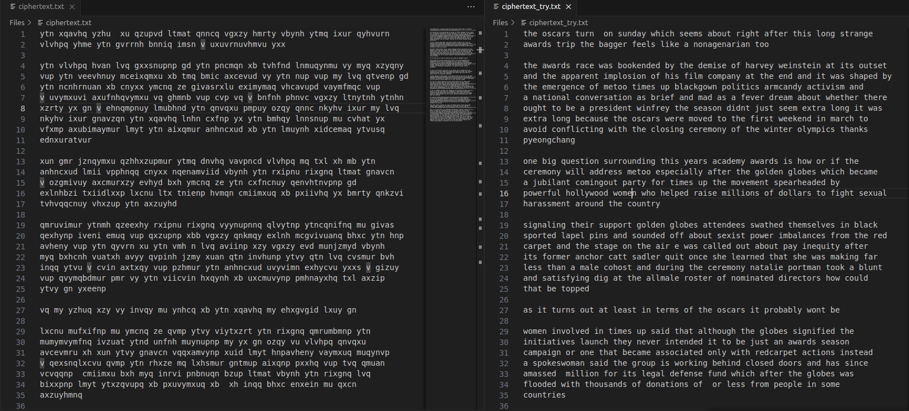
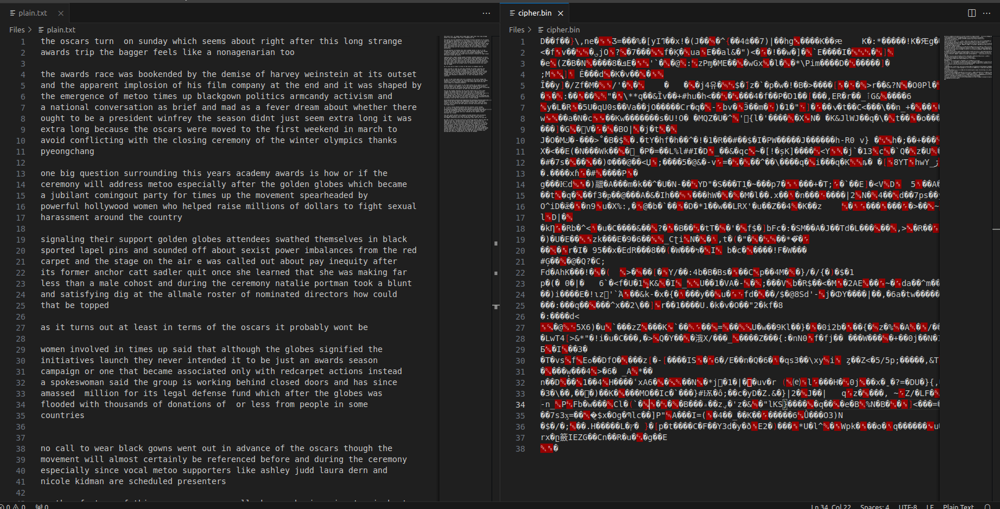
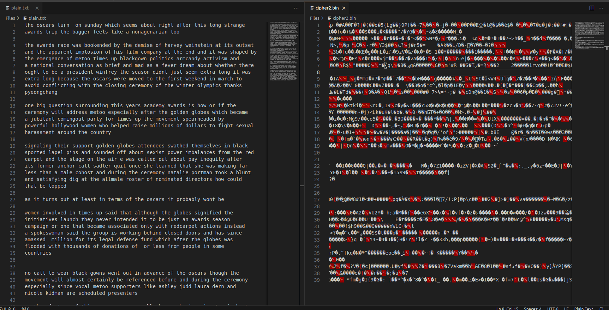
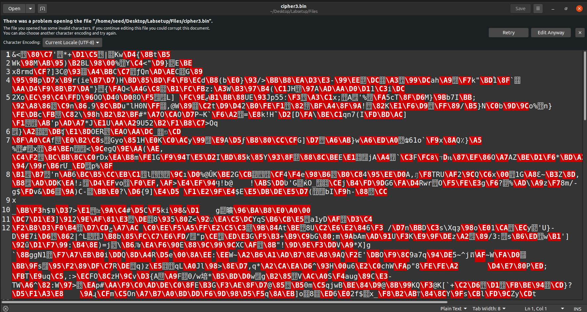
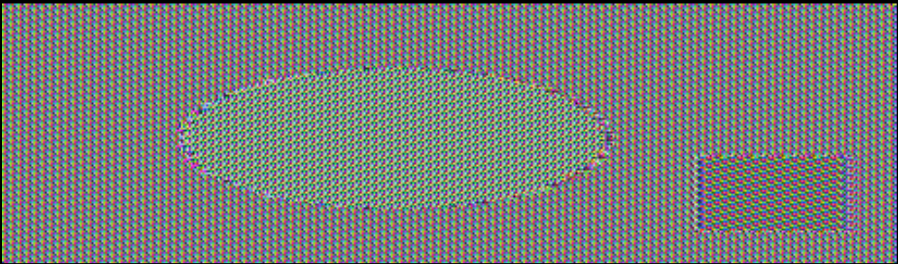

# Secret-Key Encryption Lab

## Environment Setup

> Primeiramente para resolver este _lab_ executamos os containers com ```docker-compose build``` e ```docker-compose up```. E depois fazemos ```docksh 682``` para abrir o ```seed-image-encryption``` container.

## Task 1: Frequency Analysis

> De modo a resolver a primeira tarefa começamos por executar o _python script_ da seguinte maneira: ```python3 freq.py``` que nos expôs a frequência de cada letra, bigrama e trigrama. Para o primeiro trigrama ```ytn``` começamos por consultar o _website_ da [wikipedia](https://en.wikipedia.org/wiki/Trigram) com os trigramas mais frequentes e associamos este trigrama á palavra ```the``` o que depois nos foi confirmado ao verificar a frequência dos bigramas ```yt``` e ```tn```. Para o resto das letras procedemos de maneira semelhante começamos por ir ás letras mais frequentes e se não as tivessemos decifrado procuramos bigramas e trigramas a que estas pertencessem e fomos decifrando letra a letra até obter o texto todo decifrado. Apartir de termos decifrado por volta de metade das letras o resto já conseguiamos olhar para uma palavra e decifrar o resto das letras não decifradas presentas nessa palavra. <br><br>


## Task 2: Encryption using Different Ciphers and Modes

> Esta tarefa consistiu em experimentar diferentes algoritmos e modos de encriptação utilizando o comando ```openssl enc```. O objetivo era compreender as diferenças entre várias cifras e praticar a encriptação e decriptação de ficheiros. Ao realizar esta tarefa começamos por entender como é que o comando ```openssl enc``` funcionava usando ```man openssl``` e ```man enc```:
> 1. -in \<file>: Especifica o ficheiro de entrada.
> 2. -out \<file>: Especifica o ficheiro de saída.
> 3. -e: Indica encriptação.
> 4. -d: Indica decriptação.
> 5. -K/-iv: Especifica a chave/IV em formato hexadecimal.
> 6. -[pP]: Dá _print_ ao IV/chave e depois sai se ```-P``` for utilizado.

> Após isso criamos um ficheiro chamado ```plain.txt``` onde pusemos um texto. De seguida, procedemos à encriptação do ficheiro ```plain.txt``` usando diferentes cifras. Para cada cifra, foi necessário especificar uma chave (```-K```) e um vetor de inicialização (```-iv```), ambos em formato hexadecimal. As cifras escolhidas foram ```-aes-128-cbc```, ```-bf-cbc``` e ```-aes-128-cfb```. Aqui estão os detalhes dos comandos utilizados para cada cifra:
> <br><br>Encriptação com ```AES-128-CBC```:
> ```bash
> $ openssl enc -aes-128-cbc -e  -in plain.txt -out cipher.bin \-K  00112233445566778889aabbccddeeff \-iv 01020304050607080102030405060708
>```
> 
> <br><br>Encriptação com ```BF-CBC```:
> ```bash
> $ openssl enc -bf-cbc -e  -in plain.txt -out cipher2.bin \-K  00112233445566778889aabbccddeeff \-iv 010203040506070
>```
> 
> <br><br>Encriptação com ```AES-128-CFB```:
> ```bash
> $ openssl enc -aes-128-cfb -e  -in plain.txt -out cipher3.bin \-K  00112233445566778889aabbccddeeff \-iv 01020304050607080102030405060708
>```
> 
> Após a encriptação, também testámos a decriptação para verificar a integridade e o sucesso da encriptação. Usando comandos similares com a opção ```-d``` para decriptar, assegurámos que os ficheiros originais podiam ser recuperados a partir dos ficheiros encriptados.
> <br><br>Em resumo, esta tarefa permitiu ganhar uma compreensão prática dos diferentes algoritmos de encriptação e destacou a importância de escolher a cifra apropriada e de gerir corretamente as chaves e IVs para a segurança dos dados. 

## Task 3: Encryption Mode – ECB vs. CBC

> Para resolver esta tarefa começamos por encriptar a imagem ```pic_original.bmp``` usando os dois modos de cifra ```ECB``` e ```CBC```:
> ```bash
> $ openssl enc -aes-128-ecb -e -in pic_original.bmp -out picencrypted_ecb.bmp -K 01020304050607080102030405060708
> 
> $ openssl enc -aes-128-cbc -e -in pic_original.bmp -out picencrypted_cbc.bmp -K 01020304050607080102030405060708 -iv 01020304050607080102030405060708
>```
> Após encriptarmos a imagem das duas maneiras, extraimos o ```header``` (primeiros 54 _bytes_) da imagem original:
> ```bash
> $ head -c 54 pic_original.bmp > header
>```
> Depois extraimos o resto (excluindo o header), ou seja o ```body``` de cada uma das imagens encriptadas:
> ```bash
> $ tail -c +55 picencrypted_ecb.bmp > body_ecb
> $ tail -c +55 picencrypted_cbc.bmp > body_cbc
>```
> De seguida combinamos o ```header``` da imagem principal com o ```body``` de cada uma das imagens encriptadas criando assim duas novas imagens:
> ```bash
> $ cat header body_ecb > new_ecb.bmp
> $ cat header body_cbc > new_cbc.bmp
>```
> new_ecb.bmp: <br><br>
> <br><br>
> new_cbc.bmp: <br><br>
>  <br><br>
> Observações: <br><br>
> No modo ```ECB```, padrões na imagem original podem ainda ser visíveis porque o ```ECB``` encripta blocos idênticos de texto simples em blocos idênticos de texto cifrado.<br><br>
> No modo ```CBC```, a encriptação de um bloco de texto simples depende do bloco anterior, tornando-a mais segura e menos propensa a preservar padrões em comparação com o ```ECB```.
> <br><br>Por último, experimentamos procurar uma imagem em formato ```bmp``` e realizamos o mesmo processo que para imagem anterior, obtendo resultados semelhantes aos anteriores para estes dois métodos de encriptação.