# Public-Key Infrastructure (PKI) Lab

## Environment Setup

> Primeiramente para resolver este _lab_ adicionamos a seguinte entrada ```10.9.0.80 www.bank32.com``` usando ```sudo nano /etc/hosts``` aos _hosts_ conhecidos pela _VM_ e executamos os containers com ```docker-compose build``` e ```docker-compose up```.

## Task 1: Becoming a Certificate Authority (CA)

> Para resolver esta tarefa começamos por copiar o ficheiro de certificado padrão localizado em ```/usr/lib/ssl/openssl.cnf``` para uma pasta que criamos no ambiente de trabalho. Em seguida, executámos os seguintes comandos para criar o ambiente da nossa própria _CA_:
> ```bash
> mkdir ca 
> cd ca
> mkdir certs 
> mkdir crl 
> mkdir newcerts
> touch index.txt
> echo "1000" >> serial
> ```
> Depois, procedemos à configuração da _CA_:
> ```bash
> openssl req -x509 -newkey rsa:4096 -sha256 -days 3650 -keyout ca.key -out ca.crt
> ```
> Durante o processo, inserimos os seguintes dados:
> <br><br>PEM pass phrase: abcd
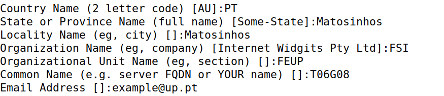
> Para analisar o conteúdo dos ficheiros gerados, decodificámos o certificado X509 e a chave RSA:
> ```bash
> openssl x509 -in ca.crt -text -noout
> openssl rsa -in ca.key -text -noout
> ```
> Confirmámos que é um certificado de _CA_, pois na secção _basic_ _constraints_ existe um atributo _CA_ verdadeiro:
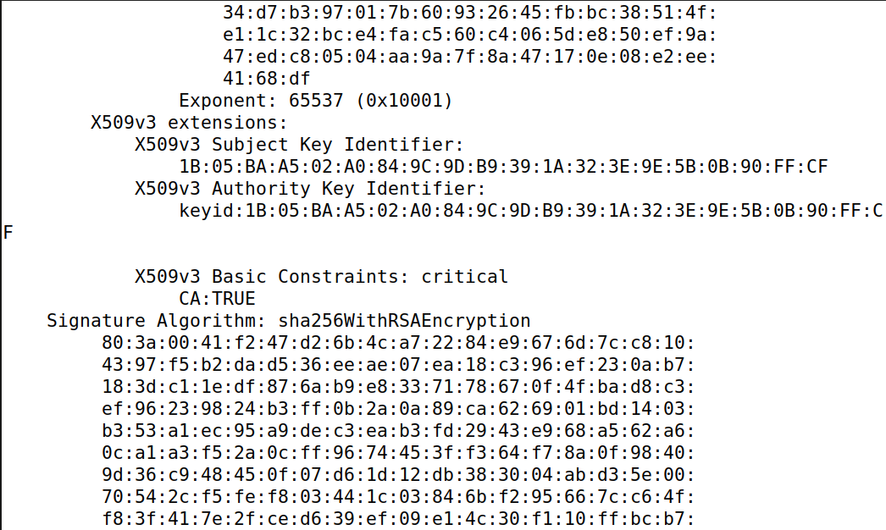
> Este certificado é _self-signed_, dado que o campo _issuer_ e o campo _subject_ são iguais:
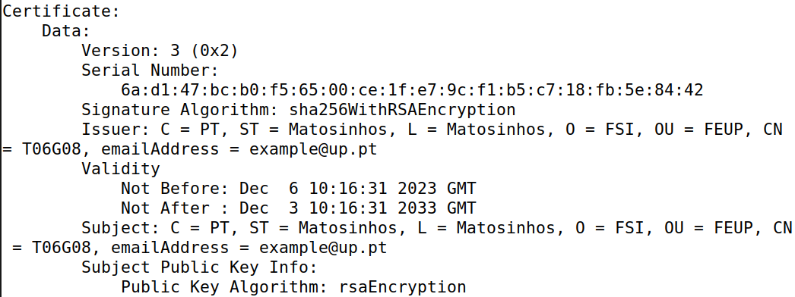
> O conteúdo do ficheiro gerado relativo à criptografia é este:
```
RSA Private-Key: (4096 bit, 2 primes)
modulus:
    00:a0:cf:45:dd:f2:b8:9c:d1:33:e4:b4:10:2e:7e:
    8a:ea:5b:0e:f9:56:89:f6:d1:29:4e:6b:7f:d6:49:
    d4:05:97:e3:2b:e9:ea:e5:c6:ef:53:cf:d9:d4:af:
    5d:1e:5e:f8:ce:24:6c:39:f3:b2:8e:26:9d:90:dd:
    a9:0e:d1:97:e1:87:5d:8c:f3:a0:0e:24:ff:de:62:
    b0:ec:1f:12:45:b9:bd:0e:4e:ac:ab:6f:bd:83:63:
    f2:74:17:3e:71:a1:c1:d0:19:21:12:06:22:05:4e:
    c5:ec:62:d7:d3:54:ab:30:7a:c8:96:4e:f7:83:73:
    5c:7c:05:dc:2a:0f:06:9d:9b:b1:a4:a0:ca:23:ce:
    a7:cc:0e:a9:da:37:2d:d3:b3:d1:e5:55:32:20:89:
    12:29:f2:59:ae:c2:b8:83:8a:29:79:8b:87:dc:a6:
    f6:d5:e4:b4:ce:77:68:91:f8:a9:71:0d:14:0d:6d:
    90:cb:cb:3c:a1:af:6d:44:3d:57:e1:bf:8d:79:3b:
    a4:2a:46:2a:8b:64:55:01:5c:0c:02:5b:3c:67:71:
    ce:f1:bc:ef:07:9e:8f:67:ba:03:cf:e9:66:45:99:
    04:41:50:8c:9a:30:9a:e4:7d:34:37:bc:6a:33:78:
    51:1f:ff:d9:08:c3:14:57:ec:44:41:d1:63:6b:b3:
    e5:22:6c:4a:8a:36:e4:e7:7b:d0:6f:c5:87:0c:fa:
    33:9e:c0:08:d6:fd:ac:6b:64:f0:dd:c6:0d:e3:bd:
    9a:9a:62:2b:bc:d4:fd:22:6f:81:1e:82:a9:3b:28:
    24:fe:49:7d:2a:ff:17:df:c3:2e:5b:b7:fe:f2:bb:
    dc:1d:3f:81:da:66:e4:1d:ff:73:fa:a2:e4:52:5e:
    d5:a2:4f:1b:49:1e:22:57:f7:8f:c2:bf:65:72:cb:
    b8:0c:ea:bc:37:56:5e:e6:95:87:32:cd:20:de:bc:
    32:33:7d:ac:7e:e0:09:4a:96:b3:a6:7b:fb:5a:02:
    f2:fb:3a:c9:22:d5:de:20:76:72:4a:44:90:29:51:
    fd:18:85:4b:21:20:c4:7a:b7:4b:a3:67:04:5b:c6:
    2d:12:c2:c1:88:de:77:51:16:43:86:46:e7:75:6c:
    83:5b:e0:c2:72:12:43:68:af:c1:53:63:10:d4:10:
    c2:12:2a:86:d6:8e:f1:0a:dc:3f:89:fe:07:b3:22:
    d0:72:6e:5b:2c:71:bf:06:4f:1b:96:f8:e0:ed:e1:
    34:d7:b3:97:01:7b:60:93:26:45:fb:bc:38:51:4f:
    e1:1c:32:bc:e4:fa:c5:60:c4:06:5d:e8:50:ef:9a:
    47:ed:c8:05:04:aa:9a:7f:8a:47:17:0e:08:e2:ee:
    41:68:df
publicExponent: 65537 (0x10001)
privateExponent:
    43:04:1e:69:d0:ad:7f:2c:f0:23:6f:a7:0e:b9:4d:
    cb:3d:07:90:81:b0:1d:5c:2d:8a:b0:e2:25:bb:be:
    d0:55:ec:26:70:e5:a3:bc:b4:20:89:8e:8e:44:46:
    da:51:59:ff:0e:ce:cb:97:f3:e1:a9:d6:20:79:3f:
    eb:1d:0d:de:bf:3b:0d:72:ba:51:2a:ba:37:43:89:
    d7:dd:5b:10:13:c7:e6:1e:83:77:2e:aa:1c:07:9b:
    13:26:5c:af:9e:69:d6:ff:a1:f8:90:f5:bc:a0:87:
    7b:6b:f5:e5:ec:73:2b:51:00:27:23:e1:a2:b6:80:
    e4:6e:cc:c1:fa:61:17:6d:bb:2a:90:97:ad:34:82:
    59:58:03:11:1d:cd:cb:5c:35:2d:0d:c4:46:2a:d9:
    97:01:98:be:6c:07:d9:49:ca:df:0c:77:22:4d:b2:
    b0:91:0f:88:bb:da:a8:7a:a8:a2:a4:80:a6:d7:f2:
    6f:fb:d2:d8:ce:f3:0a:6d:46:22:9e:61:a7:14:63:
    e5:fa:37:e0:bf:7f:6d:81:9e:bf:9c:a6:1f:b6:1e:
    38:40:34:9d:48:47:1b:43:3a:33:7b:61:53:bf:e1:
    36:17:0b:81:76:a0:16:78:d7:3a:23:1b:5f:37:d5:
    17:30:d8:91:fe:3a:8c:29:ba:88:73:6a:ab:87:dd:
    05:42:3b:95:16:6b:f3:b4:df:97:79:d3:d5:9c:18:
    02:03:a1:22:db:3f:9b:34:d8:9c:3a:ce:2e:bf:8b:
    f6:47:93:6a:d9:76:0a:69:b8:09:de:3f:4a:db:44:
    35:45:34:98:0c:58:f0:6c:38:7d:c6:2c:01:42:50:
    be:4e:08:15:0a:b8:5a:be:94:fb:a8:5f:76:02:1c:
    f8:ac:46:2b:32:14:05:39:5d:4f:bc:99:c5:48:9f:
    fb:0d:ea:32:1d:3d:ad:cb:38:75:58:2c:84:d6:b5:
    58:73:d9:61:9a:28:48:b5:3a:ef:5e:3f:7a:97:fa:
    59:d0:6c:b3:77:ff:5a:21:9b:29:db:c8:fd:0b:17:
    a2:89:46:7e:14:94:e0:1c:73:fa:76:3e:42:ea:0f:
    80:db:05:fd:01:ea:78:76:62:3f:2b:0e:bb:01:f9:
    98:d7:78:d8:48:a1:a4:d3:d4:4d:58:35:cc:87:94:
    6e:e4:dd:cd:20:81:db:fa:5a:2b:c5:02:ca:e2:e8:
    88:d1:d5:5f:ae:33:81:4b:db:40:dd:76:fc:38:a5:
    4a:a1:5a:46:3b:80:cd:6c:24:6a:82:ff:f8:4c:a5:
    d3:e6:fe:fe:0b:b6:21:fe:8f:5f:43:93:40:06:45:
    4e:98:7b:d0:88:95:52:05:ec:e4:7a:01:43:c9:6a:
    63:01
prime1:
    00:d3:41:7d:06:74:4b:be:dc:42:6b:16:a4:c0:4f:
    82:f9:4e:e5:2e:90:52:71:a1:42:5e:f0:3c:01:27:
    60:39:08:df:75:2d:73:ec:80:d4:fc:3d:42:2c:c7:
    37:36:0f:8d:e8:31:85:d5:58:34:03:75:0f:6b:87:
    4b:f6:66:7d:28:a2:ca:f0:0f:08:59:6d:65:13:cd:
    22:e8:36:ae:1b:93:0b:bf:a7:c2:20:18:b7:7a:c3:
    f6:e6:35:23:2c:05:21:aa:22:23:41:c9:a4:d1:d2:
    bc:4d:ff:23:f1:fa:d1:3f:78:dc:0b:7a:39:4f:0b:
    c2:32:b5:fd:15:16:75:e8:13:ed:a5:5f:81:e0:49:
    79:a2:45:32:52:92:eb:c1:42:9f:3a:67:86:a7:33:
    ec:68:6c:aa:79:90:ff:ed:83:5b:bd:0e:72:c8:7d:
    c2:bd:30:1f:cb:5d:18:78:da:e0:54:a2:1d:81:dc:
    97:79:f9:17:25:c0:7b:22:b8:76:52:22:f2:59:da:
    d9:4d:ad:89:43:78:0c:9b:d3:ca:ad:f3:0e:89:14:
    55:82:e8:97:bf:f0:7a:dc:9d:8f:59:f6:8b:94:94:
    2e:93:36:e4:57:09:60:07:da:ad:92:1e:20:0b:60:
    f4:75:47:93:c0:08:7d:d7:51:bf:4d:78:fc:2c:e2:
    25:59
prime2:
    00:c2:de:8a:8b:c3:25:b4:13:1a:f7:f3:c9:68:67:
    80:25:c7:3b:2d:b7:db:45:4f:25:a4:ce:61:92:35:
    3c:13:bf:dc:80:f2:49:e2:35:a4:a5:fa:cf:30:ea:
    25:2b:54:be:86:2b:37:d6:5b:89:0c:7a:d2:3b:9d:
    d8:f2:10:63:37:3b:1f:da:e8:39:8c:3f:4d:8f:3d:
    ef:a4:b1:18:75:4b:71:49:21:0e:53:a0:19:06:84:
    c5:f3:fb:4e:48:cb:f1:87:01:79:91:52:74:86:18:
    d6:54:da:4b:99:87:c5:ff:c3:38:94:f5:45:ac:f5:
    4d:a0:62:4b:a6:ce:fe:ae:43:42:76:38:ab:74:81:
    da:44:45:00:65:ef:ad:64:86:7a:1a:fb:fa:62:bc:
    c2:5f:aa:93:a2:77:b0:fb:82:53:81:78:12:87:ef:
    26:b3:87:13:6c:e6:2f:eb:61:1d:4e:4a:60:33:1a:
    f5:47:4e:24:35:02:67:44:a4:90:4e:06:7f:58:26:
    3a:8c:86:2e:51:f0:bf:37:bc:a7:eb:06:3a:14:79:
    dc:42:a1:be:8f:ba:ff:1f:0c:8a:9b:bf:57:88:ed:
    8a:ac:18:06:d6:89:08:ca:1a:e9:99:0f:d5:77:c1:
    bc:4e:4b:14:31:73:9c:f6:9a:f6:81:ab:aa:aa:be:
    60:f7
exponent1:
    05:7e:26:6a:0c:8c:0b:a2:5e:77:ba:56:fe:49:12:
    f6:b8:7e:6c:ff:83:a5:40:b4:21:13:cd:fb:99:b2:
    7e:c9:24:46:3f:b0:4b:ed:ed:9b:c1:5b:ff:1e:0e:
    e9:70:ee:17:a3:71:ff:62:13:b8:23:4b:0b:58:b1:
    38:ee:e1:42:35:39:61:94:82:7b:10:c5:18:06:b5:
    69:a4:42:52:a5:38:20:fb:93:a8:91:fb:f3:4d:35:
    16:37:3b:7a:e1:87:46:8d:2c:ad:81:38:af:db:f2:
    d9:74:50:d2:f1:da:8e:f3:ed:84:be:e0:ce:95:57:
    af:49:dc:12:b8:4a:c8:85:fc:1f:d8:a3:df:d9:09:
    38:96:e4:00:11:a1:df:9c:83:d7:58:e9:bf:5f:32:
    3e:64:d4:e9:e4:43:43:41:af:18:f3:4f:38:b7:4c:
    60:ee:e7:64:ba:3e:f0:a5:80:3f:b3:17:61:51:02:
    ff:40:e2:c1:30:88:03:17:18:bc:79:fc:23:29:f5:
    8c:77:7e:a2:2a:74:e9:78:50:44:c5:95:13:2b:5c:
    2d:d3:2e:5e:e7:39:ca:92:ae:2f:80:a1:90:73:69:
    e2:9a:02:c5:e0:90:86:a3:c0:ef:93:a8:f1:a2:cb:
    b8:60:ec:0e:8a:29:fb:77:3c:aa:1f:03:2f:87:91:
    c1
exponent2:
    62:c2:62:38:de:d7:f6:e1:4f:e3:a5:fb:c7:1b:dd:
    48:48:26:67:cf:2c:23:7e:2f:37:cd:18:89:fe:cc:
    c9:bd:8c:c5:15:05:f8:cc:f2:fa:e3:97:a9:d4:a0:
    ad:cb:2f:1b:d4:3f:62:35:d5:c9:2b:5d:ec:b4:dc:
    c4:21:26:07:51:c1:9d:31:e0:28:81:d4:8e:e9:f6:
    cf:e2:a8:e0:99:31:7a:bc:74:04:51:b9:1d:22:a1:
    28:3b:8e:bb:3a:10:d8:39:19:21:5b:46:8e:c7:7b:
    a8:59:51:c3:27:9a:63:3a:cf:2c:3e:f9:e6:e4:13:
    49:5b:47:b7:ec:64:0a:71:2f:f7:b6:54:be:a1:28:
    bb:3c:b5:2c:f4:41:4e:17:11:3f:27:c1:07:d5:5e:
    35:19:bf:e4:b1:00:53:17:03:b7:33:e1:40:5f:25:
    a0:0a:ae:ff:9b:d1:61:5b:40:7c:f3:18:ba:0d:c9:
    8d:2f:bf:0d:d6:7f:fb:bb:e3:1e:88:10:75:de:3a:
    02:09:e6:e3:c4:3d:44:c4:29:dd:e4:b3:fe:b8:9b:
    b6:71:3e:a0:9d:46:ba:b7:a2:6f:b8:93:66:63:ec:
    c9:b7:0b:90:22:b6:ff:a6:90:08:f0:8b:61:3c:20:
    71:15:7f:d0:68:25:7e:9d:9e:9c:ad:21:bb:92:ec:
    95
coefficient:
    75:c7:6c:2a:42:0b:bf:02:11:91:c1:7f:8d:04:98:
    b2:47:23:17:6a:80:7f:47:e0:f7:86:38:05:f7:4f:
    22:92:ca:84:18:d9:ad:72:70:f0:56:fd:bc:3b:79:
    a6:ab:9d:8c:bf:0a:34:bd:01:66:47:56:ff:2f:5d:
    22:c7:56:1d:79:03:d2:06:18:19:c5:fe:7c:d0:50:
    77:37:c4:b0:7e:2d:8a:a4:c4:68:87:5e:a3:dc:3c:
    3b:f9:08:5b:a3:b6:e6:99:09:ff:f9:8d:d8:00:39:
    77:76:7e:7a:09:23:c2:66:b0:00:89:d4:33:73:9e:
    52:b7:3f:0d:47:3f:be:4c:f3:27:7c:24:35:01:fc:
    cf:76:85:58:53:fb:dd:cd:20:34:c4:77:b3:65:0e:
    a3:72:94:86:a1:31:b8:9f:9d:1a:08:53:93:7b:2f:
    1b:7b:09:7e:ab:69:20:21:f5:35:60:59:41:42:2d:
    eb:56:f1:7e:2e:27:33:f0:30:d5:31:5d:cf:ca:5e:
    e4:51:9b:cc:29:44:8e:00:91:0e:01:da:b3:9e:55:
    9a:03:7b:a5:7e:cb:d2:69:cb:a2:9a:89:2f:1b:35:
    44:a9:81:c3:69:22:00:cc:cf:30:5c:af:02:02:8d:
    3b:26:11:80:d4:10:a9:f9:9d:15:be:b0:ea:3d:41:
    ac
```
> Nele, podemos identificar os seguintes elementos:
> 1. Os dois números primos (campo ```prime1``` e ```prime2```).
> 2. O _modulus_ (campo ```modulus```).
> 3. Os expoentes públicos e privados (campo ```publicExponent``` e ```privateExponent```).
> 4. O coeficiente (campo ```coeficient```).

## Task 2: Generating a Certificate Request for your Web Server

> Criámos um certificado para o _site_ ```www.bank32.com``` utilizando o seguinte comando:<br><br>
```bash
$ openssl req -newkey rsa:2048 -sha256 -keyout server.key -out server.csr -subj "/CN=www.bank32.com/0=Bank32 Inc./C=US" -passout pass:abcd -addext "subjectAltName = DNS:www.bank32.com, DNS:www.bank32A.com, DNS:www.bank32A.com"
```
> Certificado do _site_:
```
Certificate Request:
    Data:
        Version: 1 (0x0)
        Subject: CN = www.bank32.com, O = Bank32 Inc., C = US
        Subject Public Key Info:
            Public Key Algorithm: rsaEncryption
                RSA Public-Key: (2048 bit)
                Modulus:
                    00:c5:b6:a5:fb:c2:2c:78:0c:34:6a:06:70:96:97:
                    7c:8a:0f:dd:b8:17:d7:b1:3f:b0:b1:5c:c7:ee:04:
                    e4:2e:53:63:06:29:4f:5f:bf:d3:b9:ec:68:4f:6d:
                    2b:41:cc:b2:d6:75:eb:70:98:b4:23:37:76:ed:df:
                    1d:df:d1:52:be:85:df:4d:db:ca:35:de:87:62:5a:
                    0d:36:d3:dc:5d:09:cc:18:c5:77:b5:8d:ea:9e:6b:
                    fb:ec:51:d0:d5:17:05:8f:03:49:e4:56:ef:84:ca:
                    d2:69:87:0a:fc:fa:a0:ff:8e:95:c3:aa:c2:28:0f:
                    3c:91:44:1b:05:7f:64:57:9f:83:08:03:62:62:51:
                    e7:a3:f6:38:eb:b7:40:7c:73:d9:8e:0e:37:ef:d2:
                    0a:5b:75:49:dd:3d:23:42:1d:b7:62:a1:96:4e:0b:
                    b5:78:8a:76:fa:2d:c9:9c:25:2c:08:f7:70:bc:cc:
                    18:8f:a9:22:72:21:37:69:3c:59:9c:a8:9e:4a:41:
                    96:f2:2d:53:a7:78:43:99:c9:69:b3:34:4c:4c:d1:
                    c0:a9:76:16:33:c8:de:91:a6:c9:3f:53:6d:14:a3:
                    8a:6e:31:7c:0d:cf:ab:42:a4:87:7d:20:ba:cc:3d:
                    6b:7f:06:ed:84:d0:66:a5:ad:60:87:2a:d9:ac:5a:
                    b2:0b
                Exponent: 65537 (0x10001)
        Attributes:
            a0:00
    Signature Algorithm: sha256WithRSAEncryption
         34:c2:bd:b6:be:44:01:18:48:e2:05:1e:bf:00:d8:56:93:16:
         f4:c3:d6:7e:f2:b4:e4:d8:4d:ba:20:69:19:df:59:d0:5d:52:
         63:f0:3d:df:f2:ec:f7:80:21:1e:be:ef:98:a4:a3:9c:43:63:
         93:c3:81:60:4d:6d:32:aa:e0:f5:bc:3b:d5:7f:c7:d0:91:b0:
         22:e7:83:b7:e5:ae:cd:85:4b:7e:7b:9b:e1:bf:29:a1:41:ff:
         98:c2:e9:0f:e3:a9:34:71:6e:3b:0f:d2:df:9c:69:43:2e:3c:
         34:fa:97:7d:c5:6f:54:8a:cc:66:f1:1f:ec:c5:ec:b7:01:16:
         c1:31:15:a7:3f:90:ca:78:7a:c1:8d:24:20:da:69:71:bd:b0:
         b5:22:c4:3f:94:c6:59:61:46:c0:9f:6a:bc:52:65:db:16:98:
         64:37:b8:29:be:f4:f5:3f:55:48:25:15:30:0f:d0:bc:30:a7:
         4b:81:03:04:93:01:ae:1b:bd:8a:00:94:f4:f4:07:05:ae:4e:
         3c:44:64:5b:4e:80:00:4b:f6:f5:74:d7:65:06:b0:d8:2d:7a:
         8b:72:50:04:86:07:11:ab:bb:f8:dc:22:cf:31:0a:9a:a4:26:
         8f:a8:52:ec:23:fb:58:bd:b9:c0:3b:9d:ff:fd:22:b7:f3:fd:
         36:f7:2d:93
```
> _RSA_ do _site_:
```
RSA Private-Key: (2048 bit, 2 primes)
modulus:
    00:c5:b6:a5:fb:c2:2c:78:0c:34:6a:06:70:96:97:
    7c:8a:0f:dd:b8:17:d7:b1:3f:b0:b1:5c:c7:ee:04:
    e4:2e:53:63:06:29:4f:5f:bf:d3:b9:ec:68:4f:6d:
    2b:41:cc:b2:d6:75:eb:70:98:b4:23:37:76:ed:df:
    1d:df:d1:52:be:85:df:4d:db:ca:35:de:87:62:5a:
    0d:36:d3:dc:5d:09:cc:18:c5:77:b5:8d:ea:9e:6b:
    fb:ec:51:d0:d5:17:05:8f:03:49:e4:56:ef:84:ca:
    d2:69:87:0a:fc:fa:a0:ff:8e:95:c3:aa:c2:28:0f:
    3c:91:44:1b:05:7f:64:57:9f:83:08:03:62:62:51:
    e7:a3:f6:38:eb:b7:40:7c:73:d9:8e:0e:37:ef:d2:
    0a:5b:75:49:dd:3d:23:42:1d:b7:62:a1:96:4e:0b:
    b5:78:8a:76:fa:2d:c9:9c:25:2c:08:f7:70:bc:cc:
    18:8f:a9:22:72:21:37:69:3c:59:9c:a8:9e:4a:41:
    96:f2:2d:53:a7:78:43:99:c9:69:b3:34:4c:4c:d1:
    c0:a9:76:16:33:c8:de:91:a6:c9:3f:53:6d:14:a3:
    8a:6e:31:7c:0d:cf:ab:42:a4:87:7d:20:ba:cc:3d:
    6b:7f:06:ed:84:d0:66:a5:ad:60:87:2a:d9:ac:5a:
    b2:0b
publicExponent: 65537 (0x10001)
privateExponent:
    00:c4:7c:51:d4:33:12:52:73:7e:9b:67:ae:f8:59:
    af:f0:dc:f7:b1:7e:30:62:fc:32:b2:f0:cb:d8:25:
    90:46:e1:a3:e5:79:a4:62:39:97:46:8c:44:d5:ba:
    5e:64:d3:f3:5e:e2:6d:8a:c6:97:2e:f0:6e:06:d3:
    d7:32:99:2a:2c:21:8a:dc:2b:73:77:b9:a0:be:03:
    54:62:8a:85:d3:08:6b:86:aa:a7:df:0c:1c:80:38:
    3c:72:8c:94:87:50:8b:bb:a6:bf:06:67:c7:3d:26:
    fb:98:d8:15:f9:77:72:0c:c7:3c:da:e9:96:6e:8d:
    45:d9:ef:df:12:c5:99:88:e1:43:26:99:0b:af:08:
    67:f0:17:34:24:55:d5:67:b5:5b:b2:9c:fe:96:9b:
    71:18:0b:9d:44:7a:b7:a1:e8:7e:14:e4:26:f4:bd:
    20:1d:49:27:1a:08:a1:f8:a0:39:a0:58:0d:47:0b:
    3d:16:3e:92:8b:c2:f5:fb:f4:04:e8:cd:2f:79:57:
    8d:0f:b5:33:90:a3:65:01:e3:6f:ad:d5:5e:40:74:
    59:99:39:b4:45:f5:84:6e:7e:8e:8f:00:66:2b:95:
    92:29:a1:0f:eb:29:79:a8:17:bd:54:cd:0b:a9:a3:
    38:15:f5:31:f1:96:ab:58:00:fd:61:b1:06:be:79:
    4f:41
prime1:
    00:ef:5a:ca:7f:5e:3d:ef:59:47:8a:97:df:21:a5:
    b2:65:d3:af:9c:6c:48:b6:85:8b:31:bc:86:d6:2b:
    a8:05:3b:7b:71:d5:0f:b8:8e:61:3d:89:dc:4e:d4:
    0b:7d:25:89:2a:26:8f:ca:67:7e:d5:46:5c:69:67:
    47:c5:00:09:ac:7e:67:42:28:9c:15:4e:7c:68:f8:
    a8:4f:28:d9:e3:b3:81:bb:30:70:f3:60:95:e6:ab:
    45:ec:a7:8d:0d:59:1f:78:17:34:e2:6a:8b:78:67:
    80:30:ec:f0:5c:86:3d:df:ac:58:e0:45:fe:31:e1:
    c8:cd:a0:f6:b3:ea:ae:34:d1
prime2:
    00:d3:76:85:f0:f0:14:29:a0:6d:86:c3:8f:51:a3:
    c7:d8:76:27:bb:48:51:61:67:f2:fc:eb:77:df:f8:
    c8:81:7e:98:98:23:88:62:b9:36:53:d4:fd:67:70:
    2a:06:8d:e4:f1:29:a9:99:5b:f2:c4:4e:60:2e:ae:
    5b:ff:c3:bc:e3:01:de:f9:bf:ed:b1:b2:14:31:95:
    c0:9d:f3:7e:1b:20:a0:04:49:90:92:76:96:4d:0b:
    66:96:9f:3f:44:4a:02:50:ce:db:7b:91:5a:65:3d:
    7a:e6:6b:cc:47:12:85:05:c8:ed:4d:a8:30:b3:b2:
    86:b2:a1:d9:55:4b:91:20:1b
exponent1:
    00:e4:76:b9:d0:a7:48:e0:dc:4c:10:3a:f4:6d:6e:
    76:81:01:74:9f:0f:30:bc:9f:6d:84:74:da:13:35:
    aa:74:0c:19:c1:46:c8:71:b5:dd:95:5a:b0:a1:c1:
    7e:91:de:b1:35:3d:87:84:80:13:2d:49:b2:cd:9d:
    1a:81:2c:8f:0f:49:bc:10:07:29:2c:a1:34:d9:11:
    77:bd:cf:55:63:25:a5:4f:e2:65:fd:b8:94:7c:8f:
    c0:f7:a9:da:56:02:5a:aa:4b:24:5c:75:ac:58:aa:
    1a:4f:18:ea:38:b6:9d:fa:90:cc:68:8e:06:9a:e0:
    53:c6:0a:bd:50:70:52:05:f1
exponent2:
    1f:21:63:b6:84:a1:73:3f:5a:e0:6c:09:bd:4b:0f:
    30:9e:b4:5a:ad:da:cd:2c:30:69:6b:80:ca:48:25:
    bc:6a:96:ac:4f:0e:d4:f9:cf:35:a8:35:65:f4:ed:
    3a:e9:c8:ba:78:17:af:ac:09:a1:3c:a8:8c:36:be:
    f4:78:2c:66:7e:f0:04:74:6c:d9:ac:0d:ac:ff:0e:
    cc:31:fc:6e:a1:ee:ec:b2:a7:c5:e8:0f:58:68:45:
    42:07:4f:99:0e:0c:29:39:4a:b6:76:3f:88:87:f4:
    7f:d7:7e:cb:37:be:bd:8b:46:e4:17:ce:93:a5:c4:
    8e:a7:a5:07:19:88:d3:e1
coefficient:
    00:dd:70:47:17:da:ec:85:57:02:ac:39:c6:e7:cb:
    c7:96:73:9c:17:30:49:6c:cc:a1:6f:94:ab:e7:aa:
    9b:ff:f1:06:8e:89:90:45:a2:51:7a:87:df:86:98:
    24:ab:25:1b:1d:9f:94:aa:e1:4b:82:ef:4b:07:e1:
    ad:f0:4e:80:ee:81:76:b3:50:aa:6a:03:04:d1:18:
    58:16:c4:4d:fd:40:9e:76:51:d8:eb:74:00:f6:15:
    62:99:33:70:6d:9f:4e:8f:bf:14:a1:8c:ab:87:04:
    32:ca:6d:5c:76:7f:5c:ad:18:4a:7b:5e:d4:b5:f0:
    61:54:92:1e:19:73:03:d4:4a
```

## Task 3: Generating a Certificate for your server

> Para gerar um certificado para o nosso servidor ```www.bank32.com```, executamos o seguinte comando:
```bash
$ openssl ca -config openssl.cnf -policy policy_anything -md sha256 -days 3650 -in server.csr -out server.crt -batch -cert ca.crt -keyfile ca.key
```
> O conteúdo de ```server.crt``` confirma que é um certificado para o ```www.bank32.com```:
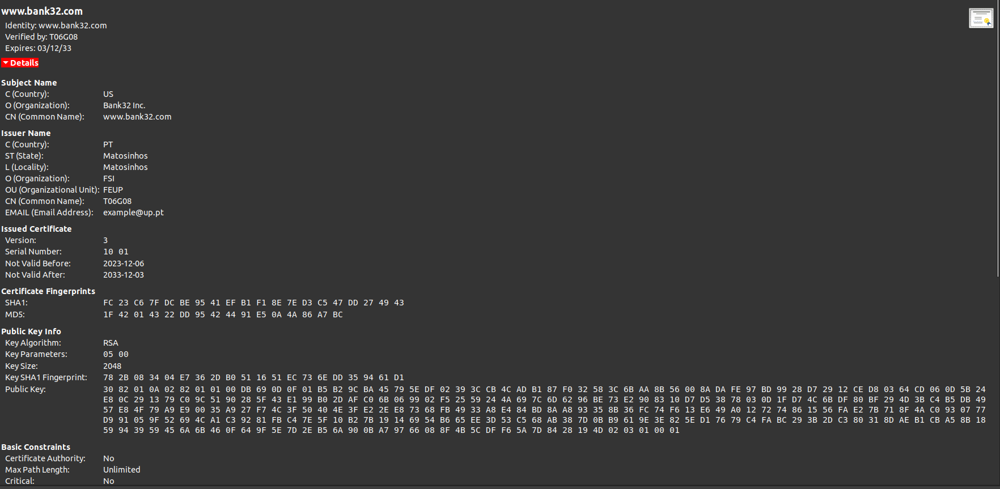
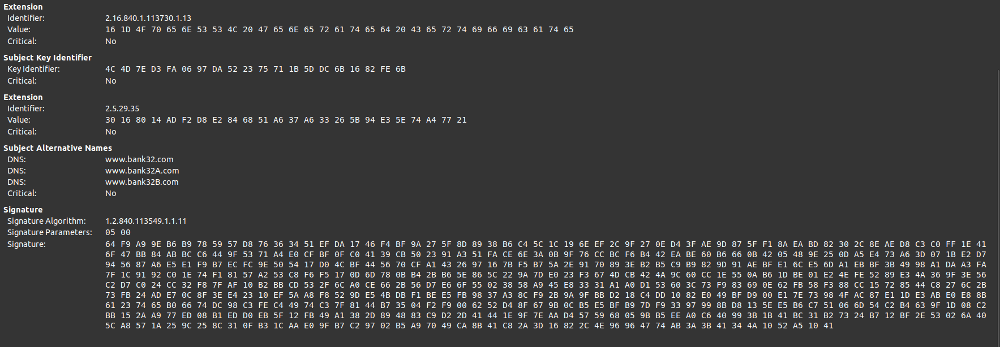
> Para verificar a abrangência do certificado, descomentamos a linha do ```copy_extensions=copy``` e executamos o seguinte comando:
```bash
$ openssl x509 -in server.crt -text -noout
```
> O resultado mostrou que o certificado cobre todos os nomes especificados na tarefa anterior:
> 1. ```www.bank32.com```
> 2. ```www.bank32A.com```
> 3. ```www.bank32B.com```
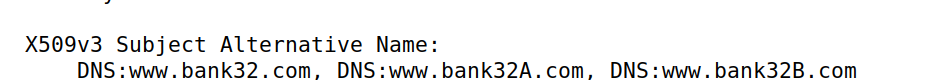

##  Task 4: Deploying Certificate in an Apache-Based HTTPS Website

> Para esta tarefa transferimos os ficheiros ```server.crt``` e ```server.key``` para a pasta partilhada ```/volumes``` e renomeamo-los para bank32, mantendo as respetivas extensões. Alteramos o arquivo ```etc/apache2/sites-available/bank32_apache_ssl.conf``` dentro do _container_, de forma a que o certificado e a chave utilizados sejam os da pasta partilhada:
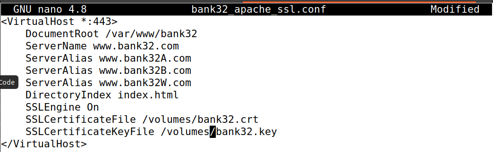
> Para arrancar com o servidor _Apache_, foi necessário primeiro abrir uma _shell_ no _container_ e executar os seguintes comandos:
```bash
$ service apache2 start
```
> Quando tentámos aceder ao site ```https://bank32.com```, percebemos que a ligação era insegura (não estava cifrada):
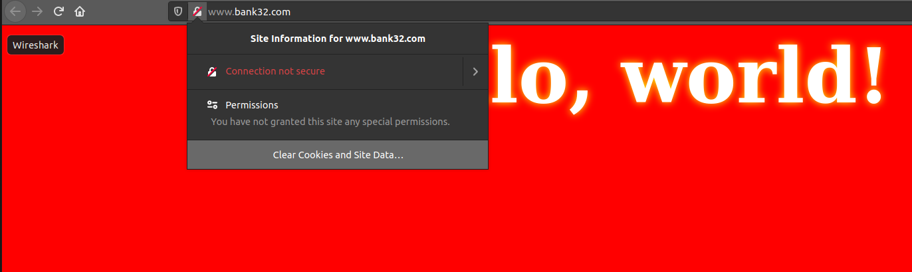
> Para assegurar uma ligação segura, adicionámos o certificado CA que gerámos às autoridades confiáveis no browser, em ```about:preferences#privacy``` -> Certificados -> Ver Certificados -> Autoridades -> Importar, e confirmámos que a ligação passou a ser segura:
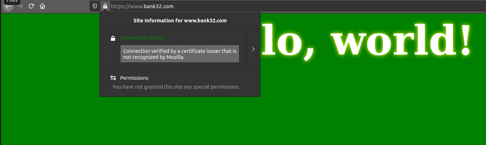

## Task 5: Launching a Man-In-The-Middle Attack

> Para esta tarefa a configuração do servidor foi alterada para agora apresentar o site ```www.example.com``` com as configurações anteriores. O ficheiro ```etc/apache2/sites-available/bank32_apache_ssl.conf``` ficou assim:
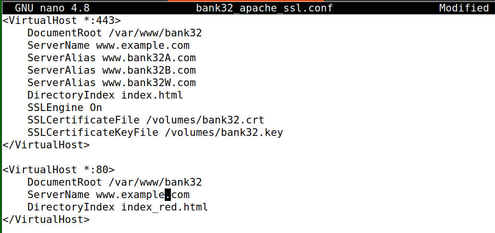
> Também alterámos o DNS da vítima, associando o hostname ```www.example.com``` ao IP do servidor web malicioso.
> <br><br>Ao reconstruir o servidor e aceder ao site ```www.example.com```, verificámos que o navegador alertava para um risco potencial:
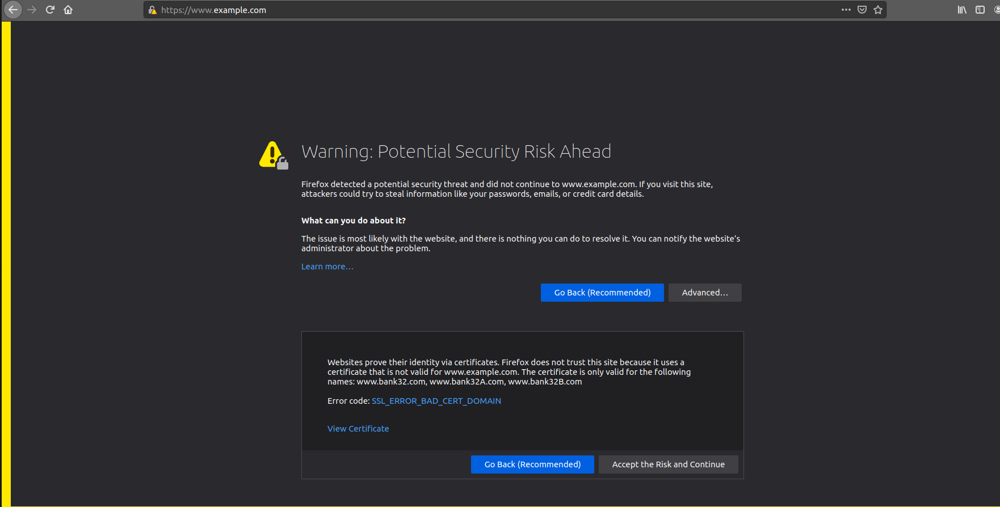
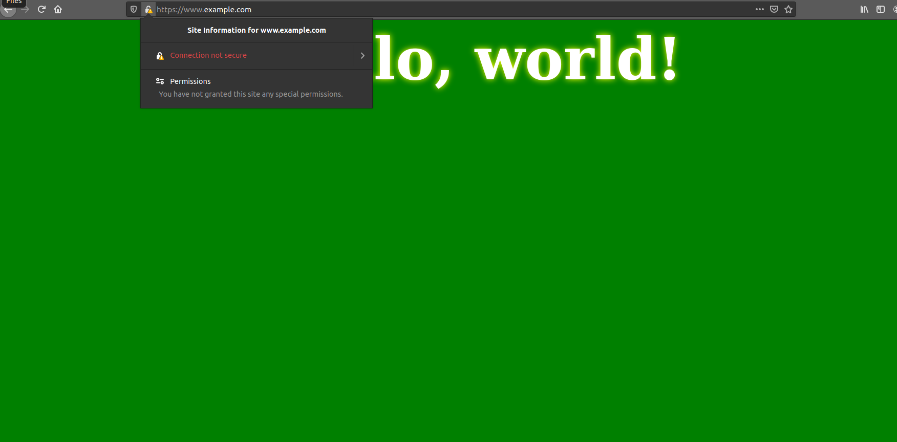
> Isto ocorreu devido à inconsistência do certificado utilizado, pois o nome de domínio não coincidia com o que estava presente no certificado do servidor.

## Task 6: Launching a Man-In-The-Middle Attack with a Compromised CA

> Supondo que a nossa CA estivesse comprometida, poderíamos usá-la para criar certificados para um site malicioso. Neste caso, queríamos criar um certificado para o site ```www.example.com```, então repetimos os comandos da Task 2:
```bash
$ openssl req -newkey rsa:2048 -sha256 -keyout example.key -out example.csr -subj "/CN=www.example.com/O=example Inc./C=US" -passout pass:abcd
$ openssl ca -config openssl.cnf -policy policy_anything -md sha256 -days 3650 -in example.csr -out example.crt -batch -cert ca.crt -keyfile ca.key
```
> Depois, modificámos o ficheiro de configuração do servidor ```etc/apache2/sites-available/bank32_apache_ssl.conf``` para usar os dois ficheiros gerados ```example.crt``` e ```example.key```:
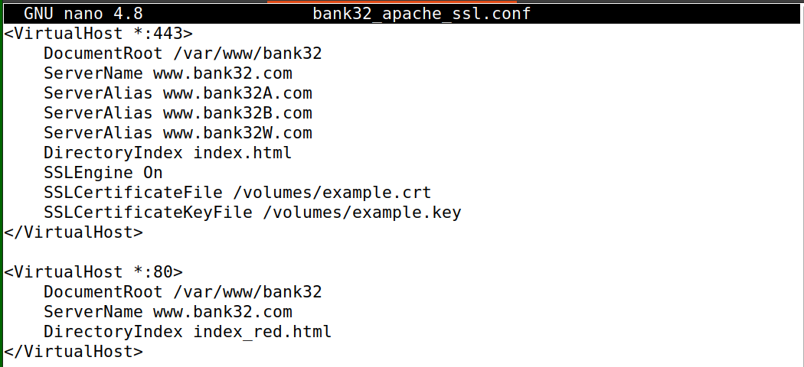
> Após reiniciar o servidor e ir a ```www.example.com```, confirmámos que a ligação já é segura:
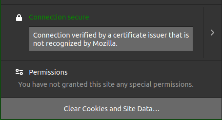


