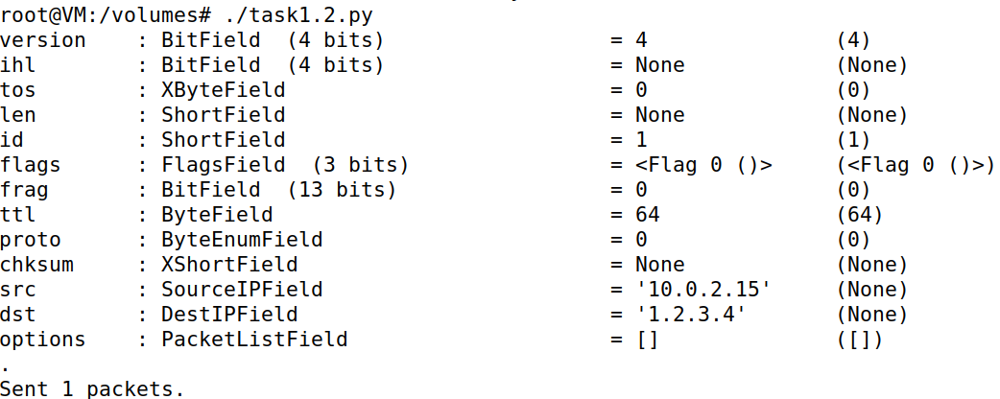
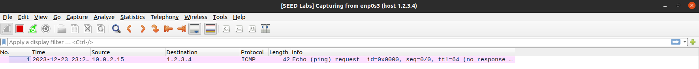

# Packet Sniffing and Spoofing Lab

## Environment Setup

> Primeiramente para resolver este _lab_ executamos os containers com ```docker-compose build``` e ```docker-compose up```. Posteriormente fizemos ```docker ps``` para verificar se os containers estavam em execução corretamente. De seguida, para interagir com um container específico, no caso o container chamado ```hostC-10.9.0.7```, executamos o comando ```docksh b2 [ID do container hostC-10.9.0.7]```.

## Task 1.1: Sniffing Packets

> Para resolver esta task começamos por pegar no script dado e criar um novo ficheiro ```sniffer.py``` e introduzir o código lá.

```python
#!/usr/bin/env python3
from scapy.all import *

def print_pkt(pkt):
    print_pkt.num_packets += 1
    print("\n=============== packet: {} ===========\n".format(print_pkt.num_packets))
    pkt.show()
print_pkt.num_packets = 0
pkt = sniff(iface='br-c63567c8961a', filter='icmp', prn=print_pkt)
```

### Task 1.1.A

> Para esta sub-task começamos por tornar o ficheiro ```sniffer.py``` num executável fazendo ```chmod a+x sniffer.py```. De seguida corremos o script e apartir do host A demos ping ao host B e verificamos que de facto conseguiamos capturar packets:
```
=============== packet: 1 ===========

###[ Ethernet ]### 
  dst       = 02:42:0a:09:00:06
  src       = 02:42:0a:09:00:05
  type      = IPv4
###[ IP ]### 
     version   = 4
     ihl       = 5
     tos       = 0x0
     len       = 84
     id        = 22268
     flags     = DF
     frag      = 0
     ttl       = 64
     proto     = icmp
     chksum    = 0xcf90
     src       = 10.9.0.5
     dst       = 10.9.0.6
     \options   \
###[ ICMP ]### 
        type      = echo-request
        code      = 0
        chksum    = 0xa9c7
        id        = 0x22
        seq       = 0x1
###[ Raw ]### 
           load      = '\xc5=\x87e\x00\x00\x00\x007\x9f\x0b\x00\x00\x00\x00\x00\x10\x11\x12\x13\x14\x15\x16\x17\x18\x19\x1a\x1b\x1c\x1d\x1e\x1f !"#$%&\'()*+,-./01234567'
```

> Depois de termos corrido o script com previlégios ```root``` fizemos ```su seed``` para mudar para a conta seed e corremos o script sem privilégios root. Tentar executar o script sem privilégios de root resultou num erro imediato (PermissionError: [Errno 1] Operation not permitted) devido à falta das permissões necessárias para operações de rede de baixo nível, especificamente a criação e utilização de sockets brutos necessários para a captura de pacotes de rede. Isso reflete as medidas de segurança presentes no sistema operacional para proteger contra atividades não autorizadas ou potencialmente prejudiciais.

### Task 1.1.B

> Para esta tarefa alteramos o nosso script da seguinte maneira para satisfazer cada um dos filtros:

```python
#!/usr/bin/env python3
from scapy.all import *

def print_pkt(pkt):
    print_pkt.num_packets += 1
    print("\n=============== packet: {} ===========\n".format(print_pkt.num_packets))
    pkt.show()
print_pkt.num_packets = 0
# ICMP Packet
pkt = sniff(iface='br-c63567c8961a', filter='icmp', prn=print_pkt)

# TCP packet from particular ip and port 23
pkt = sniff(iface='br-c63567c8961a', filter='tcp && src host 10.9.0.6 && dst port 23', prn=print_pkt)

# Capture packets from particular subnet
pkt = sniff(iface='br-c63567c8961a', filter='net 128.230.0.0/16', prn=print_pkt)
```

> O primeiro filtro já testamos na sub-task anterior mas para o segundo filtro entramos no host 10.9.0.6 e escrevemos o comando ```telnet 10.9.0.5``` e entramos com as credenciais seed:dees. Ao voltarmos ao container do atacante verificamos os resultados:

```
=============== packet: 34 ===========

###[ Ethernet ]### 
  dst       = 02:42:0a:09:00:05
  src       = 02:42:0a:09:00:06
  type      = IPv4
###[ IP ]### 
     version   = 4
     ihl       = 5
     tos       = 0x10
     len       = 52
     id        = 16931
     flags     = DF
     frag      = 0
     ttl       = 64
     proto     = tcp
     chksum    = 0xe474
     src       = 10.9.0.6
     dst       = 10.9.0.5
     \options   \
###[ TCP ]### 
        sport     = 38746
        dport     = telnet
        seq       = 1107981665
        ack       = 2941115392
        dataofs   = 8
        reserved  = 0
        flags     = A
        window    = 501
        chksum    = 0x1443
        urgptr    = 0
        options   = [('NOP', None), ('NOP', None), ('Timestamp', (2575029625, 3542150282))]


=============== packet: 35 ===========

###[ Ethernet ]### 
  dst       = 02:42:0a:09:00:05
  src       = 02:42:0a:09:00:06
  type      = IPv4
###[ IP ]### 
     version   = 4
     ihl       = 5
     tos       = 0x10
     len       = 52
     id        = 16932
     flags     = DF
     frag      = 0
     ttl       = 64
     proto     = tcp
     chksum    = 0xe473
     src       = 10.9.0.6
     dst       = 10.9.0.5
     \options   \
###[ TCP ]### 
        sport     = 38746
        dport     = telnet
        seq       = 1107981665
        ack       = 2941115413
        dataofs   = 8
        reserved  = 0
        flags     = A
        window    = 501
        chksum    = 0x1443
        urgptr    = 0
        options   = [('NOP', None), ('NOP', None), ('Timestamp', (2575029636, 3542150293))]
```

> Para testar o terceiro filtro demos ping a 128.230.0.11 e obtemos os seguintes resultados:

```
=============== packet: 8 ===========

###[ Ethernet ]### 
  dst       = 02:42:89:e4:83:d6
  src       = 02:42:0a:09:00:05
  type      = IPv4
###[ IP ]### 
     version   = 4
     ihl       = 5
     tos       = 0x0
     len       = 84
     id        = 32584
     flags     = DF
     frag      = 0
     ttl       = 64
     proto     = icmp
     chksum    = 0x306d
     src       = 10.9.0.5
     dst       = 128.230.0.0
     \options   \
###[ ICMP ]### 
        type      = echo-request
        code      = 0
        chksum    = 0xf6a4
        id        = 0x52
        seq       = 0x8
###[ Raw ]### 
           load      = '!I\x87e\x00\x00\x00\x00\x92\x7f\x07\x00\x00\x00\x00\x00\x10\x11\x12\x13\x14\x15\x16\x17\x18\x19\x1a\x1b\x1c\x1d\x1e\x1f !"#$%&\'()*+,-./01234567'

```


## Task 1.2: Spoofing ICMP Packets

> Para resolver esta tarefa começamos por criar um script ```task1.2.py``` com o código fornecido mudando o a.dst para um endereço arbitrario neste caso ```1.2.3.4```.

```python
#!/usr/bin/env python3
from scapy.all import *

a= IP()
a.dst = '1.2.3.4'
b = ICMP()
p = a / b

ls(a)

send(p)
```

> O script foi executado com sucesso, como demonstrado na imagem abaixo, onde se observa a confirmação do envio de um pacote.



> Abrindo o Wireshark na interface ```enp0s3``` e com o filtro ```host 1.2.3.4``` conseguimos observar o pacote IMCP forjado a ser enviado para o endereço ```1.2.3.4```. Esta captura foi essencial para validarmos o sucesso do nosso script de spoofing.



> A tarefa foi bem-sucedida, demonstrando a capacidade do Scapy em forjar pacotes ICMP e alterar o endereço IP de destino.

## Task 1.3: Traceroute


## Task 1.4: Sniffing and-then Spoofing