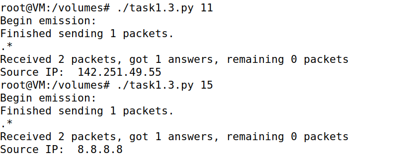
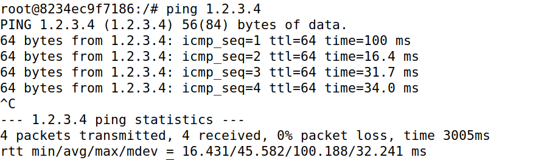
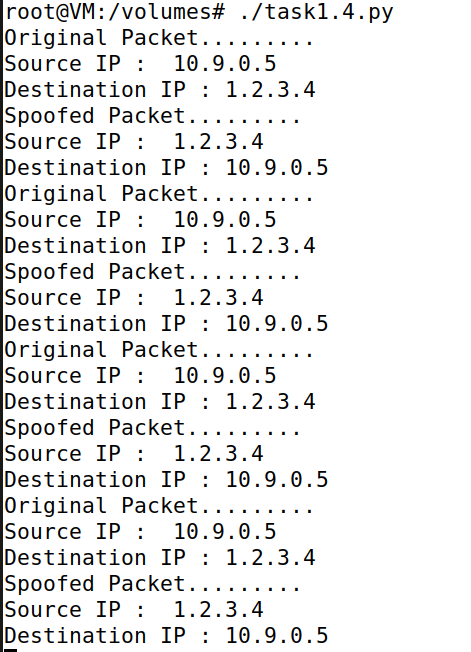
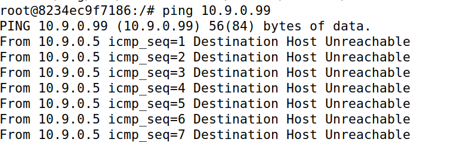
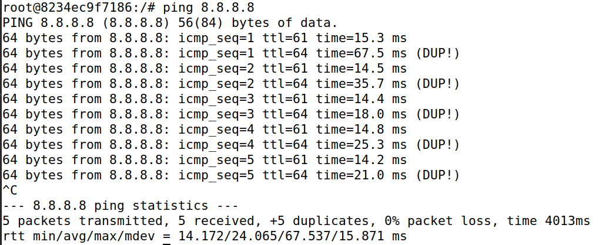

# Packet Sniffing and Spoofing Lab

## Environment Setup

> Primeiramente para resolver este _lab_ executamos os containers com ```docker-compose build``` e ```docker-compose up```. Posteriormente fizemos ```docker ps``` para verificar se os containers estavam em execução corretamente. De seguida, para interagir com um container específico, no caso o container chamado ```hostC-10.9.0.7```, executamos o comando ```docksh b2 [ID do container hostC-10.9.0.7]```.

## Task 1.1: Sniffing Packets

> Para resolver esta task começamos por pegar no script dado e criar um novo ficheiro ```sniffer.py``` e introduzir o código lá.

```python
#!/usr/bin/env python3
from scapy.all import *

def print_pkt(pkt):
    print_pkt.num_packets += 1
    print("\n=============== packet: {} ===========\n".format(print_pkt.num_packets))
    pkt.show()
print_pkt.num_packets = 0
pkt = sniff(iface='br-c63567c8961a', filter='icmp', prn=print_pkt)
```

### Task 1.1.A

> Para esta sub-task começamos por tornar o ficheiro ```sniffer.py``` num executável fazendo ```chmod a+x sniffer.py```. De seguida corremos o script e apartir do host A demos ping ao host B e verificamos que de facto conseguiamos capturar packets:
```
=============== packet: 1 ===========

###[ Ethernet ]### 
  dst       = 02:42:0a:09:00:06
  src       = 02:42:0a:09:00:05
  type      = IPv4
###[ IP ]### 
     version   = 4
     ihl       = 5
     tos       = 0x0
     len       = 84
     id        = 22268
     flags     = DF
     frag      = 0
     ttl       = 64
     proto     = icmp
     chksum    = 0xcf90
     src       = 10.9.0.5
     dst       = 10.9.0.6
     \options   \
###[ ICMP ]### 
        type      = echo-request
        code      = 0
        chksum    = 0xa9c7
        id        = 0x22
        seq       = 0x1
###[ Raw ]### 
           load      = '\xc5=\x87e\x00\x00\x00\x007\x9f\x0b\x00\x00\x00\x00\x00\x10\x11\x12\x13\x14\x15\x16\x17\x18\x19\x1a\x1b\x1c\x1d\x1e\x1f !"#$%&\'()*+,-./01234567'
```

> Depois de termos corrido o script com previlégios ```root``` fizemos ```su seed``` para mudar para a conta seed e corremos o script sem privilégios root. Tentar executar o script sem privilégios de root resultou num erro imediato (PermissionError: [Errno 1] Operation not permitted) devido à falta das permissões necessárias para operações de rede de baixo nível, especificamente a criação e utilização de sockets brutos necessários para a captura de pacotes de rede. Isso reflete as medidas de segurança presentes no sistema operacional para proteger contra atividades não autorizadas ou potencialmente prejudiciais.

### Task 1.1.B

> Para esta tarefa alteramos o nosso script da seguinte maneira para satisfazer cada um dos filtros:

```python
#!/usr/bin/env python3
from scapy.all import *

def print_pkt(pkt):
    print_pkt.num_packets += 1
    print("\n=============== packet: {} ===========\n".format(print_pkt.num_packets))
    pkt.show()
print_pkt.num_packets = 0
# ICMP Packet
pkt = sniff(iface='br-c63567c8961a', filter='icmp', prn=print_pkt)

# TCP packet from particular ip and port 23
pkt = sniff(iface='br-c63567c8961a', filter='tcp && src host 10.9.0.6 && dst port 23', prn=print_pkt)

# Capture packets from particular subnet
pkt = sniff(iface='br-c63567c8961a', filter='net 128.230.0.0/16', prn=print_pkt)
```

> O primeiro filtro já testamos na sub-task anterior mas para o segundo filtro entramos no host 10.9.0.6 e escrevemos o comando ```telnet 10.9.0.5``` e entramos com as credenciais seed:dees. Ao voltarmos ao container do atacante verificamos os resultados:

```
=============== packet: 34 ===========

###[ Ethernet ]### 
  dst       = 02:42:0a:09:00:05
  src       = 02:42:0a:09:00:06
  type      = IPv4
###[ IP ]### 
     version   = 4
     ihl       = 5
     tos       = 0x10
     len       = 52
     id        = 16931
     flags     = DF
     frag      = 0
     ttl       = 64
     proto     = tcp
     chksum    = 0xe474
     src       = 10.9.0.6
     dst       = 10.9.0.5
     \options   \
###[ TCP ]### 
        sport     = 38746
        dport     = telnet
        seq       = 1107981665
        ack       = 2941115392
        dataofs   = 8
        reserved  = 0
        flags     = A
        window    = 501
        chksum    = 0x1443
        urgptr    = 0
        options   = [('NOP', None), ('NOP', None), ('Timestamp', (2575029625, 3542150282))]


=============== packet: 35 ===========

###[ Ethernet ]### 
  dst       = 02:42:0a:09:00:05
  src       = 02:42:0a:09:00:06
  type      = IPv4
###[ IP ]### 
     version   = 4
     ihl       = 5
     tos       = 0x10
     len       = 52
     id        = 16932
     flags     = DF
     frag      = 0
     ttl       = 64
     proto     = tcp
     chksum    = 0xe473
     src       = 10.9.0.6
     dst       = 10.9.0.5
     \options   \
###[ TCP ]### 
        sport     = 38746
        dport     = telnet
        seq       = 1107981665
        ack       = 2941115413
        dataofs   = 8
        reserved  = 0
        flags     = A
        window    = 501
        chksum    = 0x1443
        urgptr    = 0
        options   = [('NOP', None), ('NOP', None), ('Timestamp', (2575029636, 3542150293))]
```

> Para testar o terceiro filtro demos ping a 128.230.0.11 e obtemos os seguintes resultados:

```
=============== packet: 8 ===========

###[ Ethernet ]### 
  dst       = 02:42:89:e4:83:d6
  src       = 02:42:0a:09:00:05
  type      = IPv4
###[ IP ]### 
     version   = 4
     ihl       = 5
     tos       = 0x0
     len       = 84
     id        = 32584
     flags     = DF
     frag      = 0
     ttl       = 64
     proto     = icmp
     chksum    = 0x306d
     src       = 10.9.0.5
     dst       = 128.230.0.0
     \options   \
###[ ICMP ]### 
        type      = echo-request
        code      = 0
        chksum    = 0xf6a4
        id        = 0x52
        seq       = 0x8
###[ Raw ]### 
           load      = '!I\x87e\x00\x00\x00\x00\x92\x7f\x07\x00\x00\x00\x00\x00\x10\x11\x12\x13\x14\x15\x16\x17\x18\x19\x1a\x1b\x1c\x1d\x1e\x1f !"#$%&\'()*+,-./01234567'

```


## Task 1.2: Spoofing ICMP Packets

> Para resolver esta tarefa começamos por criar um script ```task1.2.py``` com o código fornecido mudando o a.dst para um endereço arbitrario neste caso ```1.2.3.4```.

```python
#!/usr/bin/env python3
from scapy.all import *

a= IP()
a.dst = '1.2.3.4'
b = ICMP()
p = a / b

ls(a)

send(p)
```

> O script foi executado com sucesso, como demonstrado na imagem abaixo, onde se observa a confirmação do envio de um pacote.


> Abrindo o Wireshark na interface ```enp0s3``` e com o filtro ```host 1.2.3.4``` conseguimos observar o pacote IMCP forjado a ser enviado para o endereço ```1.2.3.4```. Esta captura foi essencial para validarmos o sucesso do nosso script de spoofing.


> A tarefa foi bem-sucedida, demonstrando a capacidade do Scapy em forjar pacotes ICMP e alterar o endereço IP de destino.

## Task 1.3: Traceroute

> O objetivo desta tarefa é encontrar o numero de routers entre a nossa VM e o destino selecionado. Para determinar isso pegamos no script de python dado e fizemos as seguintes alterações de modo a conseguirmos alterar o valor do field ttl no terminal em vez de estarmos sempre a mudar no script e de modo a dar display ao source ip e também mudamos o a.dst para ```8.8.8.8``` como pedido:

```python
#!/usr/bin/env python3
from scapy.all import *
import sys

a = IP()
a.dst= '8.8.8.8'
a.ttl = int(sys.argv[1])
b = ICMP()
d= sr1(a/b)
print("Source IP: ", d.src)
```



> Depois de executarmos o script verificamos que o teste foi realizado com sucesso, identificando-se a quantidade de routers até ao destino. Qunado o TTL foi definido como 15, o router final respondeu, indicando que o destino está a uma distância de aproximadamente 15 routers.

## Task 1.4: Sniffing and-then Spoofing

> O objetivo desta tarefa é combinar técnicas de interceção (sniffing) e falsificação (spoofing) de pacotes para criar um programa que responda automaticamente a pedidos de echo ICMP (ping), independentemente da existência do alvo. <br><br>
> Para resolver isto, criamos o seguinte script Python que basicamente intercepta pacotes ICMP de tipo "echo request" e, para cada um deles, envia de volta um pacote ICMP de tipo "echo reply" com o endereço IP de origem falsificado, fazendo parecer que o host alvo está ativo e a responder aos pings.

```python
#!/usr/bin/env python3
from scapy.all import *
import sys
import os

def spoof_pkt(pkt):
    if ICMP in pkt and pkt[ICMP].type == 8:
        print("Original Packet.........")
        print("Source IP : ", pkt[IP].src)
        print("Destination IP :", pkt[IP].dst)

        ip = IP(src=pkt[IP].dst, dst=pkt[IP].src, ihl=pkt[IP].ihl)
        icmp = ICMP(type=0, id=pkt[ICMP].id, seq=pkt[ICMP].seq)
        data = pkt[Raw].load
        
        newpkt = ip/icmp/data

        print("Spoofed Packet.........")
        print("Source IP : ", newpkt[IP].src)
        print("Destination IP :", newpkt[IP].dst)

        send(newpkt, verbose=0)
        
filter = 'icmp and host x.x.x.x'
pkt = sniff(iface='br-c63567c8961a',filter=filter, prn=spoof_pkt)
```

> ```1.2.3.4```: 





> Este endereço é um host inexistente na Internet. No entanto, o script está a responder aos pings como se o host estivesse ativo. Isso demonstra a eficácia do script em fazer parecer que um endereço IP inexistente está ativo, evidenciado pela resposta bem-sucedida dos pings.

> ```10.9.0.99```:



> Este é um host inexistente na LAN. As mensagens de "Destination Host Unreachable" indicam que o ping não está a encontrar um caminho para o endereço na rede local. 

> ```8.8.8.8```: 




> Este é um host existente na Internet (google). As respostas de ping são bem-sucedidas, o que é esperado para um host ativo. O script também está a enviar respostas falsificadas, mas essas respostas são desnecessarias porque o host real responderá independentemente.