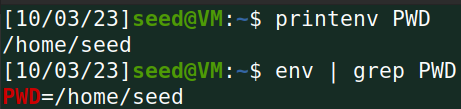
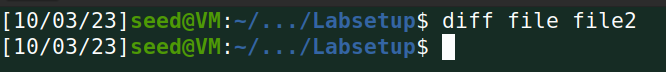

# Environment Variable and Set-UID Program Lab

## Task 1: Manipulating Environment Variables

> Nesta _task_ aprendemos que com os comandos `printenv` ou `env` conseguimos dar _print_ a uma variável do sistema. O exemplo que nos é apresentado é para a variável **PWD**:

## Task 2: Passing Environment Variables from Parent Process to Child Process

> Na segunda _task_ é nos pedido para guardar o output (variáveis ambientais) de um programa **myprintenv.c** de duas maneiras distintas, usando a função `printenv` para o processo filho e depois para o processo pai. Fazendo isso obtemos dois ficheiros **file** e **file2** que são iguais comprovando que todas as variáveis ambientais do processo pai são herdadas pelo processo filho.

