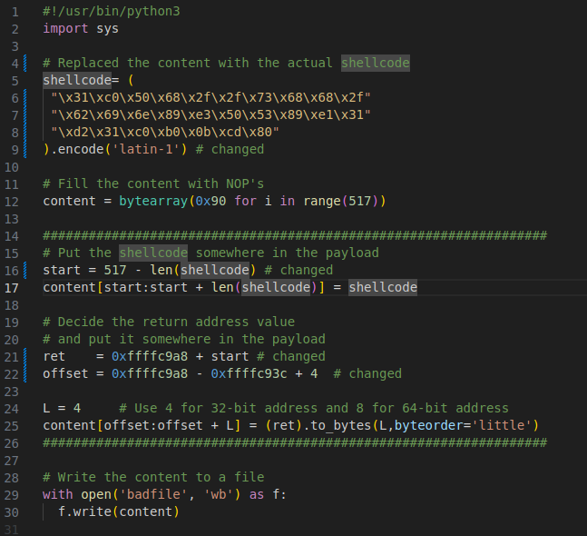
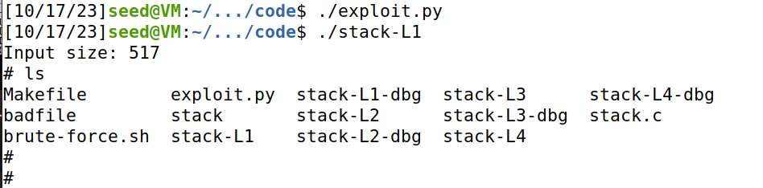
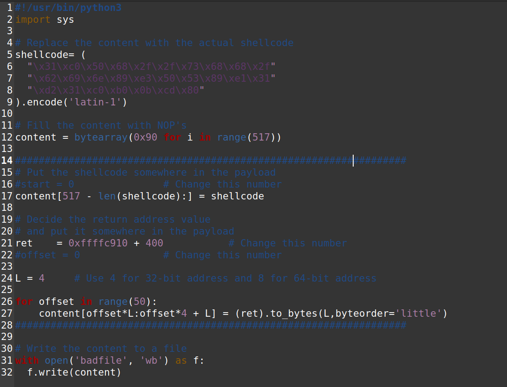
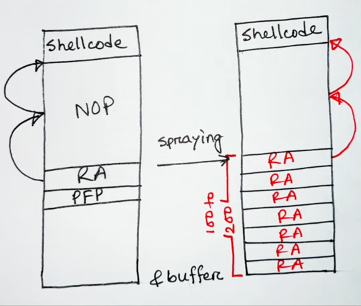
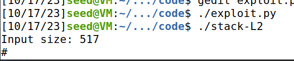

# Buffer Overflow Attack Lab (Set-UID Version)

## Environment Setup

> Primeiramente para resolver este _lab_ começamos por desativar as _countermeasures_ do _Ubuntu_ de modo a simplificar os nossos ataques. Vamos desativar a randomização de espaços de endereços, uma vez que, com esta ativada seria difícil advinhar os endereços exatos de memória. Também vamos desativar a proibição Depois desativamos a proibição na _shell_ para permitir a execução por processos com _Set-UID_.
>```bash
> $ sudo sysctl -w kernel.randomize_va_space=0
> $ sudo ln -sf /bin/zsh /bin/sh
>```

##  Task 1: Getting Familiar with Shellcode

> Iniciamos o processo executando um programa simples que inicia uma shell através do comando ```execve```. Esse programa utiliza uma abordagem convencional, onde são definidos os argumentos e a chamada de sistema ```execve``` é feita.
> ```c
> char *name[2];
> name[0] = "/bin/sh";
> name[1] = NULL;
> execve(name[0], name, NULL);
> ```
> Posteriormente, replicamos o mesmo comportamento usando o _shellcode_ correspondente para ambas as arquiteturas, 32 bits e 64 bits. Esse _shellcode_ foi invocado a partir da _stack_, permitindo que a execução também resultasse na abertura de uma nova _shell_.

##  Task 2: Understanding the Vulnerable Program

> Nesta _task_ começamos por examinar o código que nos é fornecido no programa ```stack.c```, e conseguimos logo á partida averiguar que existe uma vulnerabilidade de _buffer overflow_ uma vez que tentamos copiar os conteúdos de uma _string_ ```str``` de 517 _bytes_ para um _buffer_ que só tem 100 _bytes_ de tamanho usando a função ```strcpy``` que não verifica os limites do _buffer_ originando assim o _buffer overflow_.<br><br>
> Para enfraquecer a segurança do programa, desativamos certas proteções, como o _StackGuard_ e a prevenção contra a execução de código a partir da _stack_. Além disso, alteramos as permissões do programa para _root_ e transformamos o programa num programa _Set-UID_. 
> ```bash
> $ gcc -DBUF_SIZE=100 -m32 -o stack -z execstack -fno-stack-protector stack.c
> $ sudo chown root stack
> $ sudo chmod 4755 stack
> ```

## Task 3: Launching Attack on 32-bit Program (Level 1)

> Nesta _task_ começamos por criar um ficheiro vazio ao qual chamamos ```badfile```. De seguida damos _debug_ ao ```stack-L1-dbg``` de modo a encontrar a posição do endereço de retorno da função ```bof``` em relação ao início do _buffer_. Usámos o ```gdb``` para o _debug_ e colocamos um _breakpoint_ na função ```bop``` da seguinte maneira: <br>
> ```bash
> $ touch badfile  # <- Create an empty badfile
> $ gdb stack-L1-dbg # executar o programa em modo debug
> gdb-peda$ b bof # <- Set a break point at function bof()
> Breakpoint 1 at 0x12ad: file stack.c, line 16.
> gdb-peda$ run # <- Start executing the program
> ...
> Breakpoint 1 at 0x12ad: file stack.c, line 16.
> 16      {
> gdb-peda$ next # Avançamos com algumas instruções até que o registro ebp passe de apontar para a stack frame da função que chamou "bof()" para a stack frame da própria função "bof()".
> ...
> 20	    strcpy(buffer, str); 
> gdb-peda$ p $ebp # <- Get the ebp value
> $1 = (void *) 0xffffc9a8
> gdb-peda$ p &buffer # <- Get the buffer's address
> $3 = (char (*)[100]) 0xffffc93c
> gdb-peda$ quit # <- Exit
> ```
> Desta maneira adquirimos os endereços que precisávamos, agora vamos por no ficheiro ```badfile``` o conteúdo que queremos inserir no _buffer_ (_shellcode_ e endereço de retorno que aponta para esse _shellcode_). Para isto usamos o programa fornecido em _python_, com as seguintes alterações: <br><br>
>  
> Figura 1: Python script task 3<br><br>
> Alterações feitas e notas: <br>
> 1. Mudamos a variável ```shellcode``` para a que nos forneceram no ```call_shellcode.c``` (32-bits) que executa uma _shell_.
> 2. Cria-se um _bytearray_ chamado ```content``` de tamanho 517 _bytes_, em que todos os _bytes_ nesse _array_ são 0x90 (NOP's).
> 3. Criamos uma variável ```ret``` que vai conter o novo endereço de retorno que aponta para o _shell code_ a executar.
> 4. Utilizando os dois endereços obtidos durante o processo, calculamos a posição do endereço de retorno em relação ao início do _array_ (```offset```). Em seguida, substituímos o endereço de retorno original pelo novo endereço que aponta para o _shellcode_ calculado anteriormente (```ret```). <br> <br>
> De seguida corremos o _script_ ```exploit.py``` que nos gerou o ficheiro ```badfile```. <br><br>
> Depois executamos o programa ```stack-L1``` que deu _trigger_ a um _buffer overflow_ e lançou uma _shell_ com permissões _root_.<br><br>
>
> Figura 2: Root Shell

##  Task 4: Launching Attack without Knowing Buffer Size (Level 2)

> Nesta _task_ fizemos a parte inicial igual á _task_ 3. Dar _make_ e criar um ficheiro _badfile_, depois damos _debug_ a ```stack-L2-dbg``` para encontrarmos o endereço do _buffer_. Depois disto alteramos o programa fornecido em _python_, com as seguintes modificações: 
> 
> Figura 3: Python script task 4 <br><br>
> Modificações feitas e notas: <br>
> 1. ```content[517 - len(shellcode):] = shellcode``` faz com que ponhamos o _shellcode_ no final do _badfile_.
> 2. A _return address_ pusemos igual ao início do _buffer_ e acrescentamos um número maior do que 200 de modo a entrarmos na área NOP (Figura 4) (neste caso tentamos com 300 ao início e não deu mas com 400 já deu).
> <br>
> Figura 4<br><br>
> 3. Como não sabemos o tamanho do _buffer_ vamos ter de dar _spray_ ao _buffer_ para por a _return address_ em muitos lugares para desse modo pelo menos um dos endereços ser o _actual return address_. Foi isso que fizemos no _for loop_. Usamos 50 de _range_ no _for loop_ uma vez que disseram nos que o tamanho do _buffer_ ia até no máximo 200, ou seja, como cada endereço em 32-bit ocupa 4 bytes 200/4=50. <br><br>
> Depois executamos o programa ```stack-L2``` que deu _trigger_ a um _buffer overflow_ e lançou uma _shell_ com permissões _root_.<br><br>
>
> Figura 2: Root Shell


