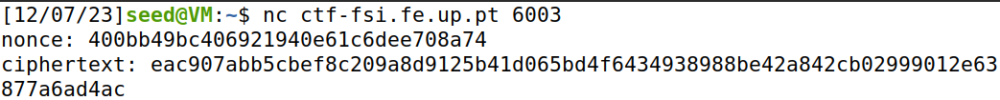
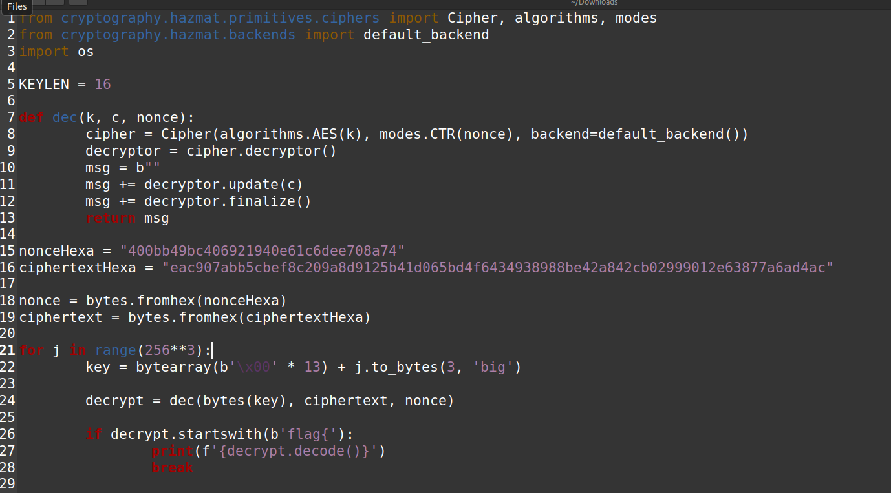
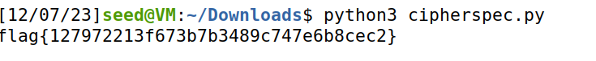

# CTF Semana 10 Weak Encryption

> Após a análise do ficheiro ```cipherspec.py```, detetámos uma vulnerabilidade significativa na forma como as chaves são geradas para o algoritmo de criptografia ```AES-CTR```. A função de geração de chaves ```gen``` foi configurada para preencher a maior parte da chave com bytes nulos ```\x00```, variando apenas os últimos 3 _bytes_ de forma aleatória. Esta configuração limita drasticamente o número de chaves possíveis, tornando um _brute force attack_ exequível. Conseguimos acesso ao ```nonce``` e ao ```ciphertext``` executando o seguinte comando: 
> ```bash
> $ nc ctf-fsi.fe.up.pt 6003
> ```
> 
> <br><br>```nonce```: 400bb49bc406921940e61c6dee708a74
> <br>```ciphertext```: eac907abb5cbef8c209a8d9125b41d065bd4f6434938988be42a842cb02999012e63877a6ad4ac
> <br><br>Como consigo usar esta ciphersuite para cifrar e decifrar dados? Para cifrar e decifrar dados usando ```AES-CTR```, normalmente utilizaria-se a função de geração de chaves para criar uma chave segura. Contudo, devido à vulnerabilidade identificada, a segurança desta operação está comprometida. Ainda assim, o processo técnico de cifrar e decifrar dados permanece o mesmo: cifrar dados com a chave (e ```nonce```) gerados e decifrar usando a mesma chave (e ```nonce```).
> <br><br>Para explorar esta vulnerabilidade, desenvolvemos um _python script_ que percorre todas as combinações possíveis dos últimos três _bytes_ da chave. O _script_ tenta decifrar a mensagem cifrada fornecida pelo desafio utilizando cada chave potencial. Quando uma chave resulta numa mensagem decifrada que começa com ```flag{```, assumimos que a _flag_ correta foi encontrada.
> <br><br> Python script:<br><br>
> <br><br>
> 


