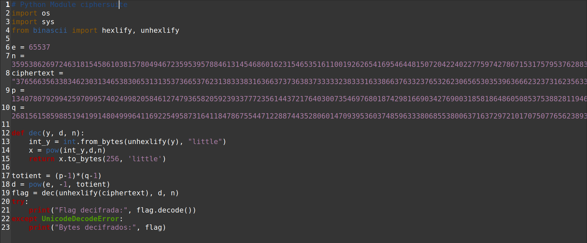
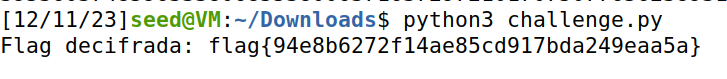

# CTF Semana 11 RSA

> O objetivo do CTF desta semana era fatorizar um módulo ```RSA```, conhecendo parte dos primos usados para calculá-lo, e utilizar esse módulo para decifrar a mensagem de uma _flag_.<br><br>
> Ao conectar ao servidor usando ```nc ctf-fsi.fe.up.pt 6004```, recebemos o módulo (n), o expoente público (e) e o texto cifrado (ciphertext). Com os valores de e, n e o texto cifrado fornecidos, o desafio consistia em encontrar os primos ```p``` e ```q``` tais que ```p * q = n```. Com essa informação, poderíamos calcular a chave privada, decifrar o texto cifrado e obter a flag.<br><br>
```bash
Public parameters -- 
e:  65537 
n:  359538626972463181545861038157804946723595395788461314546860162315465351611001926265416954644815072042240227759742786715317579537628833244985694861278987734749889467798189216056224155419337614971247810502667407426128061959753492358794507740889756004921248165191531797899658797061840615258162959755571367021109
ciphertext: 3765663563383462303134653830653131353736653762313833383163663737363837333332383331633866376332376532623065653035396366623237316235633230366364356438326462326337303533656630353334313566643730323139333532323637613365663264363437376566633635313939653664646633366662353534653834303935393263346266336361343633366333646339356364346139636266626332333736386531633065363264633164363138346330323461313966623839626230303434366433643263383165393431326530373130663434313936623431663037386633616633633766663564306431653939343930303030303030303030303030303030303030303030303030303030303030303030303030303030303030303030303030303030303030303030303030303030303030303030303030303030303030303030303030303030303030303030303030303030303030303030303030303030303030303030303030303030303030303030303030303030303030303030303030303030303030303030303030303030303030303030303030303030303030303030303030303030303030303030303030303030303030303030303030303030303030303030303030303030303030303030303030303030303030303030303030303030303030303030303030303030
```
> No enunciado do CTF, recebemos informações adicionais sobre os valores de p e q:
1. p é um primo próximo de ```2^512```
2. q é um primo próximo de ```2^513```
> Foi também sugerido que o algoritmo [Miller-Rabin](https://inventwithpython.com/rabinMiller.py) seria útil para testar a primalidade dos números.<br><br>
> Utilizámos a função ```isPrime``` desse algoritmo e começámos a testar valores em busca de ```p``` e ```q```. Escolhemos um intervalo _random_ de 15 000 e testámos todos os primos nesse intervalo, tendo como ponto central ```2^512```. Assim, encontrámos valores possíveis para p. Depois, verificámos se, para cada p encontrado, existia um q primo tal que ```p * q = n```. Isso foi feito testando se n era divisível por p e, em caso afirmativo, se o quociente era um número primo. Se sim, este seria o valor de q.
```python
n= 359538626972463181545861038157804946723595395788461314546860162315465351611001926265416954644815072042240227759742786715317579537628833244985694861278987734749889467798189216056224155419337614971247810502667407426128061959753492358794507740889756004921248165191531797899658797061840615258162959755571367021109

interval = 15000

p = (2**512 + 1) - interval

while p < 2**512 + interval:
    if isPrime(p):
        q, resto = divmod(n, p)
        if resto == 0 and isPrime(q):
            print(p, "---------\n", q)
    p += 2
```
> Resultado:
```
p: 13407807929942597099574024998205846127479365820592393377723561443721764030073546976801874298166903427690031858186486050853753882811946569946433649006084823
q: 26815615859885194199148049996411692254958731641184786755447122887443528060147093953603748596333806855380063716372972101707507765623893139892867298012169683
```
> Com p e q conhecidos, só restava calcular ```d```, que é o inverso multiplicativo de e módulo totient, onde ```totient = (p - 1) * (q - 1)```. Com todos os valores necessários, executamos o seguinte _script_:

> <br>Após executarmos este _script_ foi nos dada a _flag_ terminando assim a resolução deste _ctf_:

