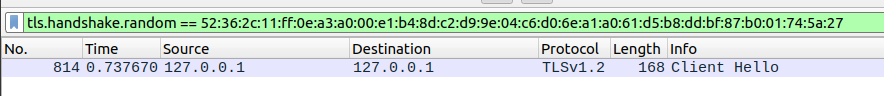
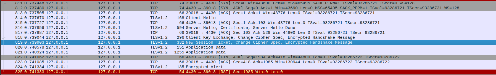
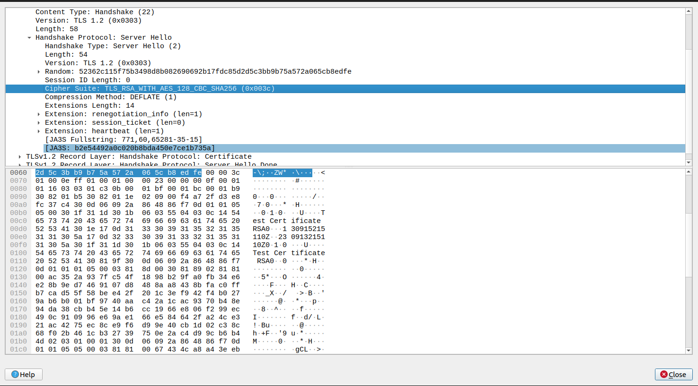
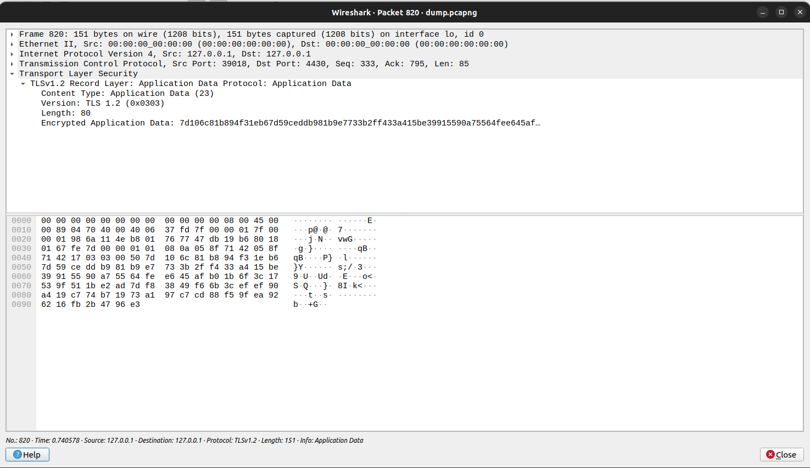
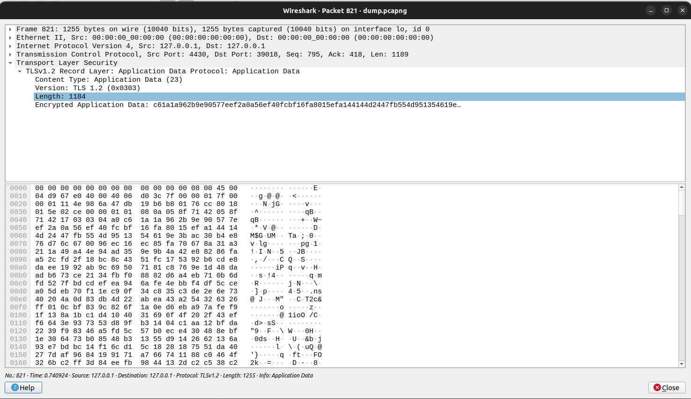
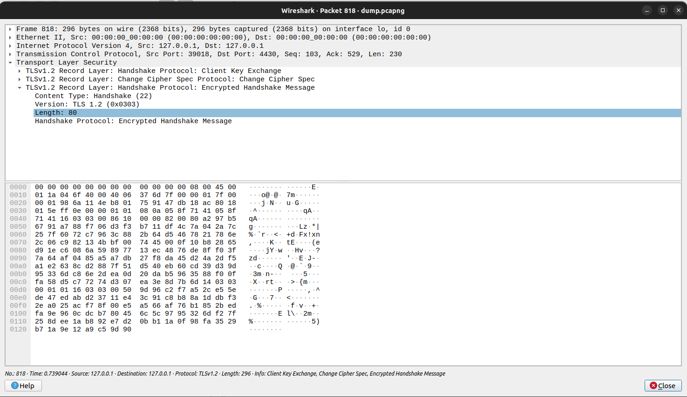

# CTF Semana 13 Find-my-TLS

> Primeiramente para resolver este CTF abrimos o ficheiro ```dump.pcapng``` com o Wireshark. De seguida procuramos pelo pacote que contém a mensagem de Client Hello com o número aleatório ```52362c11ff0ea3a000e1b48dc2d99e04c6d06ea1a061d5b8ddbf87b001745a27```. Para fazer isto de uma maneira eficiente usamos os filtros do Wireshark. O filtro que usamos foi o seguinte:<br> ```tls.handshake.random == 52:36:2c:11:ff:0e:a3:a0:00:e1:b4:8d:c2:d9:9e:04:c6:d0:6e:a1:a0:61:d5:b8:dd:bf:87:b0:01:74:5a:27``` <br>Que nos mostrou o seguinte pacote:<br>

> <br>Feito isto descobrimos o ```<frame_start>``` que é ```814```. Depois disto, apartir da imagem abaixo descobrimos o ```<frame_end>``` que vai ser ```819``` pois é o fim do handshake devido à presença da mensagem Change Cipher Spec seguida da Encrypted Handshake Message. <br>

> <br>De seguida, para encontrarmos a ```<selected_cipher_suite>``` entramos nos detalhes do pacote Server Hello (816), e inspecionando esta página encontramos facilmente o nome da ciphersuite escolhida para a conexão TLS : ```TLS_RSA_WITH_AES_128_CBC_SHA256```.

> Após isto para determinar o ```<total_encrypted_appdata_exchanged>``` bastou fazer a soma da length dos pacotes de Application Data que deu: 80 (pacote 820) + 1184 (pacote 821) = ```1264```.


> Por fim para encontrar o ```<size_of_encrypted_message>``` bastou-nos verificar a length do último pacote antes do final do handshake, neste caso do pacote 818 que apartir da imagem abaixo podemos concluir que é ```80```.

> Com estes dados todos podemos construir a flag ficando assim com a seguinte flag: ```flag{814-819-TLS_RSA_WITH_AES_128_CBC_SHA256-1264-80}``` e terminando assim este ctf.