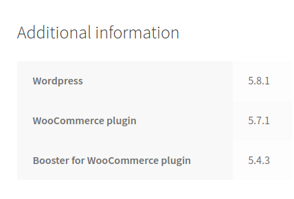
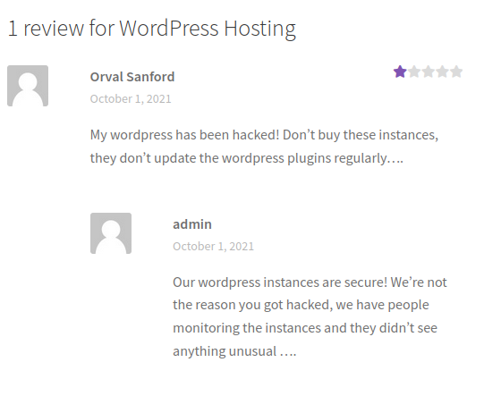
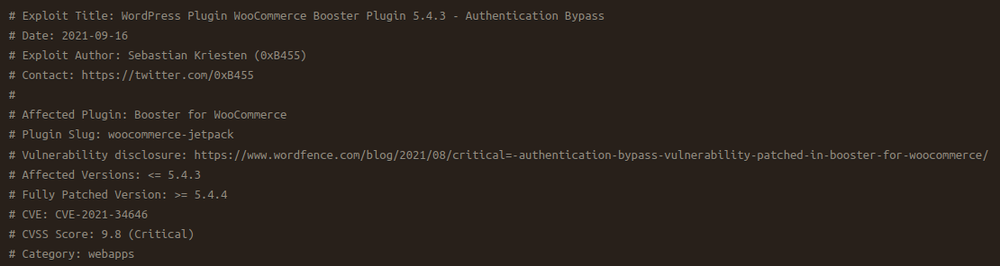
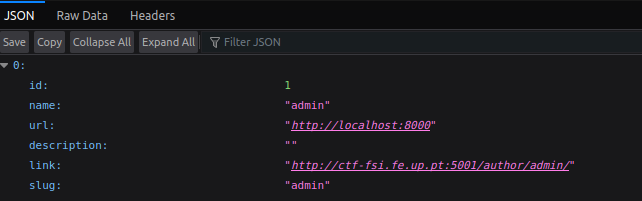
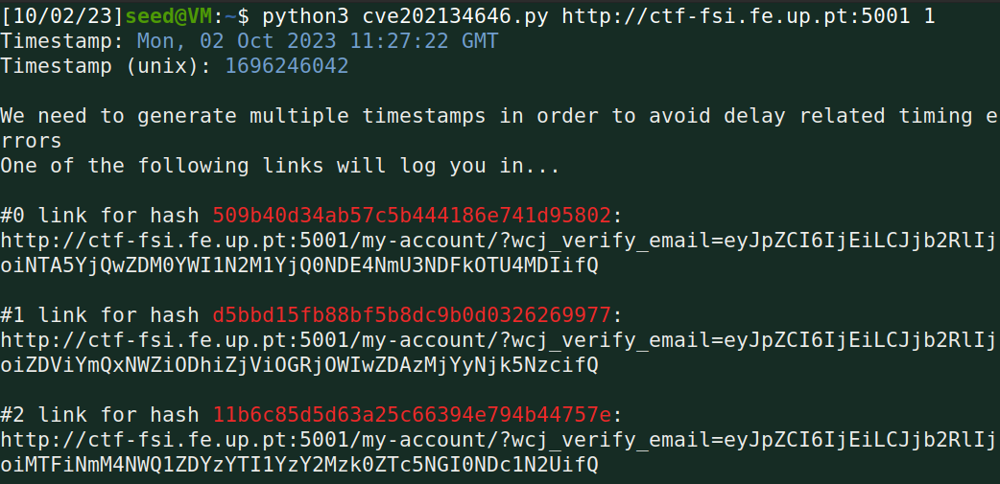
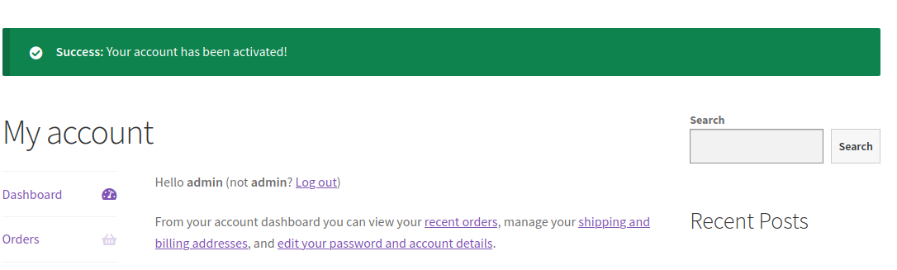
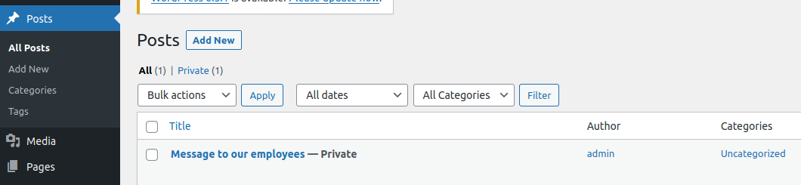
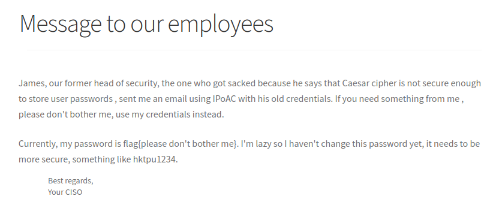

# CTF 1 - Wordpress CVE

> Em primeiro lugar para resolver este CTF entramos no  [servidor de Wordpress fornecido](http://ctf-fsi.fe.up.pt:5001/) e começamos por encontrar e identificar a versão do wordpress, plugins instalados e as suas respetivas versões.

Figura 1 : Informações sobre versões do wordpress e plugins instalados. 

> Também encontramos 2 possíveis utilizadores sendo estes admin e Orval Sanford (Figura 2). Para a frente neste relatório vamos ver que nos focamos só no admin.

Figura 2 : Possíveis utilizadores.

> Depois de termos identificado versões dos plugins encontramos uma vulnerabilidade para um em específico, sendo este o "Booster for WooCommerce Plugin 5.4.3". A vulnerabilidade foi catalogada como [CVE-2021-34646](https://www.cvedetails.com/cve/CVE-2021-34646) e permite-nos dar _bypass_ á autenticação e deste modo dar _impersonate_ a um _user_.

> Após a identificação da vulnerabilidade encontramos um exploit para a mesma na [exploit database](https://www.exploit-db.com/exploits/50299).

Figura 3 : WordPress Plugin WooCommerce Booster Plugin 5.4.3 - Authentication Bypass

> De seguida seguimos os passos descritos nos comentários do exploit começando por encontrar o user-ID e o user correspondente do adminstrador deste servidor. Para fazer isto acedemos a http://ctf-fsi.fe.up.pt:5001/wp-json/wp/v2/users/ e encontramos o user que tinhamos identificado anteriormente (admin) e o user-ID dele (Figura 4).

Figura 4 : JSON com o user-ID para o admin.

> Seguindo para o segundo passo procedemos ao ataque. Fizemos download do script de python e corremo-lo da seguinte maneira : `python3 cve202134646.py http://ctf-fsi.fe.up.pt:5001 1`. Após executar o script foram nos _outputted_ três _links_ (Figura 5).

Figura 5 : Output após correr o exploit.

> Depois de termos obtido os _links_ acedemos ao primeiro que nos forneceu acesso ao servidor como **admin** (Figura 6).

Figura 6 : Acesso como admin ao servidor.

> Após isso clicamos em "Secure WP Hosting" que nos levou a uma _dashboard_. Investigamos a _dashboard_ e verificamos que ao clicar em _Posts_ tinhamos acesso a uma mensagem privada enviada pelo admin que continha a flag deste CTF, flag{please don't bother me}, terminando assim a resolução do mesmo (Figura 7 e 8).

Figura 7 : Post com a mensagem privada enviada pelo admin.

Figura 8 : Mensagem que contém a flag.

