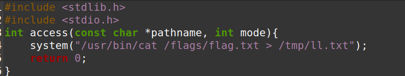
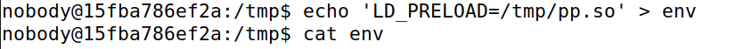
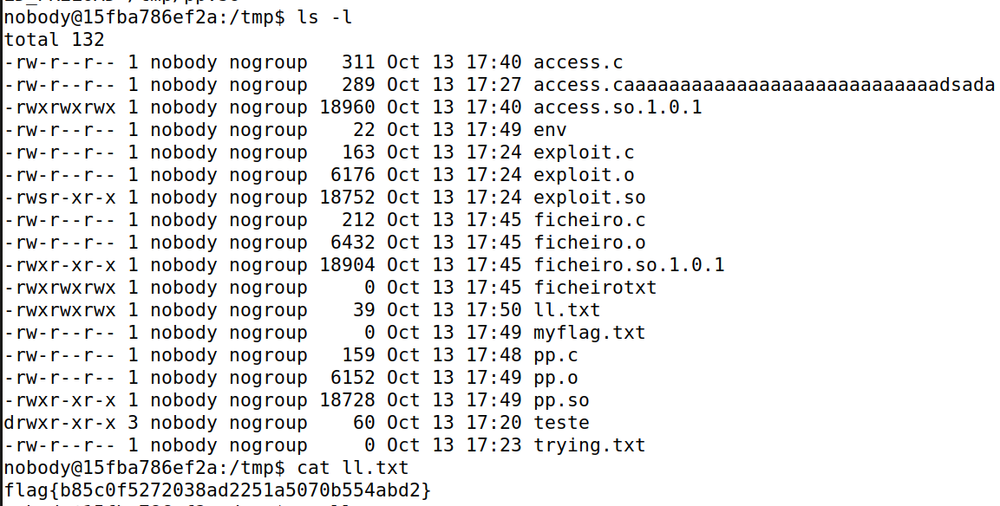

# CTF 2 - Linux Environment

> Para resolver este _CTF_ a primeira coisa que fizemos depois de nos conectarmos ao servidor foi analisar os ficheiros que estavam presentes neste servidor e as suas permissões. No diretório inicial (/home/flag_reader) (read-only) tinhamos vários ficheiros, dos quais "my_script.sh" que dava _source_ as _environment variables_ e depois executava o binário "_reader_" que é o código compilado do ficheiro "main.c". Também descobrimos que este _script_ é constantemente executado a cada minuto. Depois fomos para o diretório "/" e vimos que tinhamos um diretório chamado "/flags" mas não conseguimos aceder ao mesmo porque era preciso ser _root_. Também encontramos um diretório "/tmp" e este já dava para criar ficheiros. Depois de termos esta informação toda começamos por criar um ficheiro "ll.txt" para onde a flag vai ser _outputted_ e demos também ``chmod 777 ll.txt`` para conceder permissões totais a este ficheiro. Depois criamos o nosso programa "pp.c".

Figura 1 : pp.c

> Depois disto compilamos o programa e criamos uma _static library_ a partir do mesmo fazendo   ``gcc -fPIC -g -c pp.c``   e depois  ``gcc -shared -o pp.so pp.o -lc``   ficando assim com uma _library_ com nome pp.so. De seguida tirando partido do que aprendemos na _Task_ 6 e _Task_ 7 mudamos a _environment variable_ ``LD_PRELOAD`` para "/tmp/pp.so" da seguinte maneira:

Figura 2 : Mudança da variável ambiental

> Depois foi só esperar que passasse o minuto e quando fomos ver tinhamos a _flag_ no nosso ficheiro "ll.txt" concluindo assim este _ctf_.

Figura 3 : flag.

