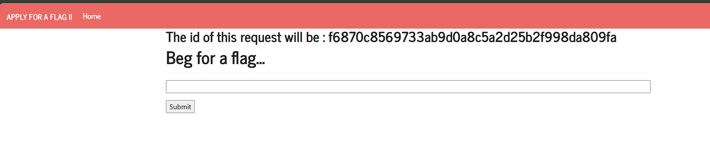
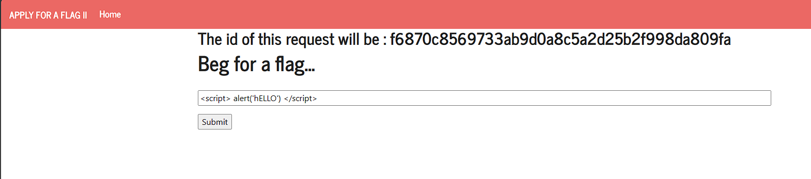
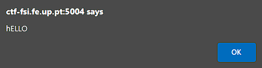
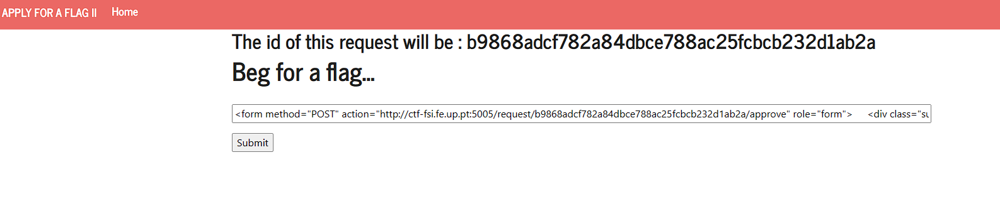
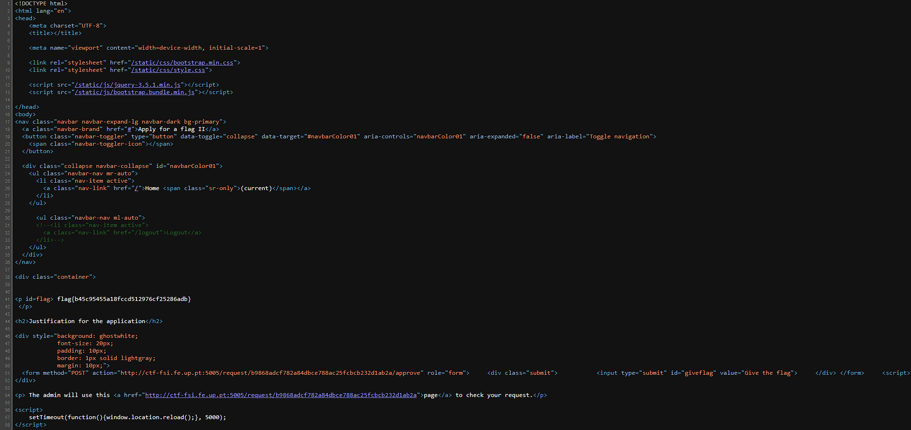

# CTF 4 - (XSS + CSRF)

> Para este _CTF_ é nos dado a seguinte página:



> Primeiramente verificamos se esta página é suscetível a um ataque XSS da seguinte maneira:





> Depois de clickarmos `Submit` somos redirecionados para uma página que vai avaliar o nosso _request_. Esta página dá _reload_ de 5 em 5 segundos. Clickando em `page` vamos para a página do `admin` onde este consegue dar a _flag_ se clickar no butão que diz `Give the flag`.

> Inspecionando este butão podemos ver que o seu código é:
````html
<form method="POST" action="/request/d43f3b267ab583567f484f4193502f4ba0e01945/approve" role="form"> 
    <div class="submit"> 
        <input type="submit" id="giveflag" value="Give the flag" disabled="">
    </div> 
</form>
````

> Se nós tirarmos `disabled` do input e clickarmos no butão vamos ser redirecionados para uma página onde nos diz que não temos permissões suficientes para dar a _flag_. Sendo assim, tentamos encontrar uma maneira de clickar no botão com as permissões de `admin`.

> Para isso pegamos no código e alteramo-lo da seguinte maneira:

````html
<form method="POST" action="http://ctf-fsi.fe.up.pt:5005/request/requestID/approve" role="form">
    <div class="submit">  
        <input type="submit" id="giveflag" value="Give the flag">
    </div>
</form>
    <script>
        document.getElementById('giveflag').click();
    </script>
````

> De seguida, voltamos á página inicial e alteramos o `requestID` no _form_ para o atual (`b9868adcf782a84dbce788ac25fcbcb232d1ab2a` neste caso). De seguida submetemos esse _form_ da seguinte maneira:



> Ao submetermos fomos redirecionados para a página onde nos diz que não temos permissões suficientes. Mas desta vez o butão já foi clickado pelo `admin`. Se voltarmos á página inicial e fizermos `view page source` e depois adicionarmos o _id_ do nosso _request_ ao _url_ deparamo-nos com o seguinte:



> Examinando este código observamos que na linha 41 encontra-se a _flag_ correspondente ao nosso _request_ terminando assim este _CTF_.
