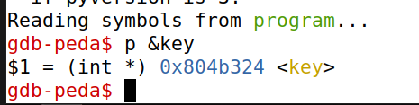
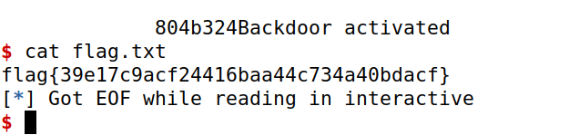

# CTF Semana 7 Format Strings

## Desafio 1

> Inicialmente, exploramos os ficheiros disponibilizados, que são os mesmos em execução no servidor na porta 4004. Ao utilizar o comando ```checksec```, verificamos que o executável ```program``` não possui endereços aleatórios, mas apresenta proteções contra ataques de retorno usando canários.
> ```bash
> $ checksec --file=program
> ```
> Em seguida, analisamos o funcionamento do código contido em ```main.c```. O _input_ é armazenado num _buffer_ de 32 _bytes_ por meio da função ```scanf()``` e posteriormente é impresso pelo ```printf()``` sem argumentos adicionais (linha 27). Isso abre a possibilidade de realizar um _format string attack"_ para manipular o comportamento dele, uma vez que não há randomização dos endereços.<br>
> Quando a função ```load_flag``` é chamada, ela lê a flag do diretório para outro _buffer_, o qual é uma variável global e, portanto, está alocado na _Heap_. Ao descobrirmos o endereço dessa função usando o debugger gdb:
> ```bash
> $ gdb program
> $ p load_flag
> ```
> Obtivemos o endereço de retorno ```0x08049256```, que pode ser representado como ```\x60\xC0\x04\x08``` em formato de _string_.<br>
> Usando o _script_ em _Python_ fornecido, injetamos o _input_ contendo o _exploit_:
> ```python
> p.recvuntil(b"got:")
> p.sendline(b"\x60\xC0\x04\x08%s")
> p.interactive()
> ```
> Ao executar o _exploit_, conseguimos aceder ao conteúdo do ficheiro ```flag.txt``` e obter a _flag_ do desafio, que é ```flag{1fe6a99595415888d00946c1dad865af}```.


## Desafio 2

> Inicialmente, exploramos os ficheiros disponibilizados, que são os mesmos em execução no servidor na porta 4005. Ao utilizar o comando ```checksec```, verificamos que o executável ```program``` não possui um executável independente de posição, o que significa que o código não é alocado num local da memória que permita a execução independentemente do seu endereço absoluto. Adicionalmente, inclui um canário na _stack_, uma medida preventiva usada para proteger contra _buffer overflows_.
> <br><br>Ao analisarmos o ficheiro ```main.c```, observamos que, para efetuar um ataque bem sucedido e aceder ao valor da _flag_, é necessário modificar o valor da nossa variável ```key``` para ```beef```, que em decimal é convertido para 4779.
> <br><br>De seguida, precisamos de encontrar o endereço de memória da variável ```key``` da seguinte maneira:<br><br>

> <br><br>Agora precisamos de alterar o valor de ```key``` para 4779 (beef). Para alcançar o objetivo, é necessário escrever 4775 _bytes_ (acrescidos de 4 _bytes_ para o endereço desejado) antes de utilizar o ```%n```. Também é preciso referenciar adequadamente o endereço ao qual o ```%n``` irá escrever o valor. Devemos incluir um ```$1``` junto ao ```%n``` para que este aponte para os primeiros 4 _bytes_ que foram enviados. Portanto, o _script_ deve ser alterado da seguinte forma:
> ```python
> p.recvuntil(b"here...")
> p.sendline(b"\x24\xb3\x04\x08" + b"%48875x" + b"%1$n")
> p.interactive()
> ```
> Executando o _script_ obtemos:<br><br>
> 

