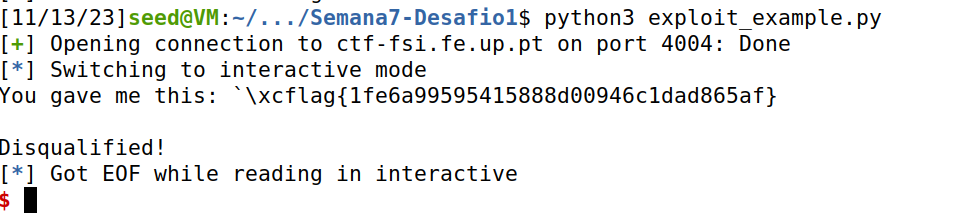

# CTF Semana 7 Format Strings

## Desafio 1

> Inicialmente, exploramos os ficheiros disponibilizados, que são os mesmos em execução no servidor na porta 4004. Ao utilizar o comando ```checksec```, verificamos que o executável ```program``` não possui endereços aleatórios, mas apresenta proteções contra ataques de retorno usando canários.
> ```bash
> $ checksec --file=program
> ```
> Em seguida, analisamos o funcionamento do código contido em ```main.c```. O _input_ é armazenado num _buffer_ de 32 _bytes_ por meio da função ```scanf()``` e posteriormente é impresso pelo ```printf()``` sem argumentos adicionais (linha 27). Isso abre a possibilidade de realizar um _format string attack"_ para manipular o comportamento dele, uma vez que não há randomização dos endereços.<br>
> Quando a função ```load_flag``` é chamada, ela lê a flag do diretório para outro _buffer_, o qual é uma variável global e, portanto, está alocado na _Heap_. Ao descobrirmos o endereço dessa função usando o debugger gdb:
> ```bash
> $ gdb program
> $ p load_flag
> ```
> Obtivemos o endereço de retorno ```0x08049256```, que pode ser representado como ```\x60\xC0\x04\x08``` em formato de _string_.<br>
> Usando o _script_ em _Python_ fornecido, injetamos o _input_ contendo o _exploit_:
> ```python
> p.recvuntil(b"got:")
> p.sendline(b"\x60\xC0\x04\x08%s")
> p.interactive()
> ```
> Ao executar o _exploit_, conseguimos aceder ao conteúdo do ficheiro ```flag.txt``` e obter a _flag_ do desafio, que é ```flag{1fe6a99595415888d00946c1dad865af}```.


## Desafio 2

