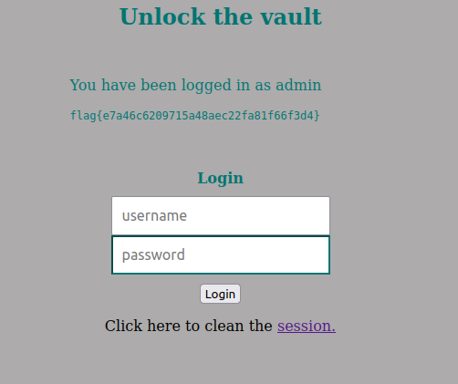

# CTF Semana 8 SQL Injection

> Começamos por fazer _download_ do ficheiro _index.php_. Após uma breve análise deste verificamos que depois de entrar como admin o conteúdo do ficheiro ```flag.txt``` é mostrado na página _web_. Na seção de _login_, a consulta utilizada é vulnerável, pois o servidor constrói dinamicamente o comando com _strings_ não sanitizadas provenientes da entrada do _user_:
> ```php
> $username = $_POST['username'];
>               $password = $_POST['password'];
>               
>               $query = "SELECT username FROM user WHERE username = '".$username."' AND password = '".$password."'";
> ```
> Ao usar a técnica de _SQL Injection_ com o _input_ ```admin'--```, asseguramos o acesso privilegiado. Isso ocorre porque toda a verificação da _password_ torna-se irrelevante, uma vez que é comentada. Dessa forma, o código executado no lado do servidor é modificado para o seguinte:
> ```sql
> SELECT username FROM user WHERE username = 'admin'-- AND password = $password
> ```
> Após inserirmos ```admin'--```no _username_, verificamos que entramos como adminstrador na página e apareceu-nos a _flag_ deste _ctf_.


